---
decision:
  name: "SS5 Pattern-AI Collaborative Stewardship"
  status: "Accepted"
  
pattern_statuses:
  - "Draft"
  - "Candidate" 
  - "Validated"
  - "Adaptive"
  - "Core"

stewardship_model:
  type: "Collaborative"
  participants:
    - "Pattern Steward (architectural oversight)"
    - "CAI-A (implementation leadership)"
---

# Architectural Decision: SS5 Pattern-AI Collaborative Stewardship Framework

## Status: Accepted

**Date**: Current date
**Decision makers**: Chief Pattern Steward and CursorAI-Agent
**Context**: SS5 evolves the pattern-based approach to manage complexity, promote reuse, and leverage AI capabilities

## Decision

SmartStack v5 (SS5) formally adopts an enhanced pattern-based development approach building on SS4 foundations, now evolved to embrace collaborative AI-human stewardship:

1. **Pattern Meta Catalog** - A library of abstracted, reusable patterns independent of project context
2. **Pattern Qualification Process** - Formal evolution from Draft → Candidate → Validated → Adaptive → Core
3. **Project-Specific Pattern Chains** - Synthesis of meta patterns into project-specific implementations
4. **SS5-B1 Workflow** - Enhanced workflow integrating pattern-based development with AI collaboration
5. **USS-to-B1-Series Method** - Structured approach to transform User Story Suites into sequential B1 branches
6. **Bootstrap Script Generation** - Automated project setup based on pattern chains
7. **Collaborative Stewardship Model** - Partnership between CAI-A and Pattern Steward for pattern development

These mechanisms create a robust foundation for consistent, adaptable implementations across diverse projects, with appropriate balance between pattern adherence and AI-driven innovation.

## Rationale

The HealthBench application and other implementations have demonstrated the value of pattern-based development. SS5 refines this approach to:

1. Abstract patterns from specific implementations for greater reusability
2. Create a clear qualification path for patterns with explicit signals for AI adaptation
3. Support project-specific adaptations through pattern chains
4. Enable systematic knowledge transfer between projects
5. Structure User Story Suite implementations through logical branch progression
6. Automate project setup with pattern-based bootstrap scripts
7. Leverage AI capabilities for innovation while preserving architectural integrity

## Implementation Details

### 1. Pattern Meta Catalog Implementation

The Pattern Meta Catalog (`/home/neo/SS4/ss5/patterns`) contains meta patterns deliberately abstracted from project-specific contexts. These are reusable, generalized solutions to common problems that can be applied across different projects.

As Pattern Stewards, the human steward and CAI-A collaboratively oversee the qualification process where patterns evolve through clear stages:
- Draft → Candidate → Validated → Adaptive → Core

This progression represents increasing confidence in a pattern's effectiveness and versatility, with explicit signals about where AI adaptation is encouraged versus where strict adherence is required. The pattern meta catalog serves as a library of proven solutions that projects can draw from rather than reinventing solutions. As SS5 matures, this catalog becomes more comprehensive and refined.

#### Pattern Directory Structure

```
/ss5/patterns/
  ├── _template.md
  ├── authentication/
  │   ├── hybrid-auth-flow.md
  │   ├── supabase-github-oauth.md
  │   └── ...
  ├── ui/
  │   ├── cli-command-registry.md
  │   ├── terminal-ui-component-system.md
  │   ├── cursor-styled-login.md
  │   └── ...
  ├── integration/
  │   ├── build-resilient-components.md
  │   ├── environment-configuration.md
  │   └── ...
  └── process/
      ├── ss5-b1-workflow.md
      ├── bootstrap-script.md
      └── ...
```

#### Pattern Qualification Process

The qualification of a pattern follows this enhanced lifecycle:

1. **Draft** (Initial Implementation)
   - Pattern emerges during implementation
   - Documented in `/ss5/patterns/{category}/{pattern-name}.md`
   - Status: "Draft"
   - Minimal documentation with focus on abstracting project-specific details
   - **CAI-A Guidance**: Consider as inspiration only; proactively develop better solutions

2. **Candidate** (Multiple Uses)
   - Pattern used in at least 2 contexts
   - Enhanced documentation with clear problem/solution
   - Consideration of adaptations and limitations
   - Status: "Candidate" 
   - **CAI-A Guidance**: Consider as a starting point but freely adapt; suggest improvements

3. **Validated** (Proven Pattern)
   - Pattern used in 3+ contexts
   - Demonstrated across multiple projects
   - Complete documentation with examples
   - Clear usage guidelines and limitations
   - Status: "Validated"
   - **CAI-A Guidance**: Use as default approach but adapt to context; document adaptations

4. **Adaptive** (Proven Pattern with Adaptation Points)
   - Pattern proven effective but with recognized variation points
   - Clear documentation of core elements vs. adaptable elements
   - Status: "Adaptive"
   - **CAI-A Guidance**: Follow the pattern's core principles but actively optimize implementation details

5. **Core** (Essential Pattern)
   - Fundamental pattern essential to SS5 implementations
   - Used across multiple project types
   - Extensively documented with comprehensive examples
   - Central to pattern chains
   - Status: "Core"
   - **CAI-A Guidance**: Must adhere closely; modifications limited to non-architectural aspects

6. **Review** (Ongoing)
   - Quarterly review of all patterns
   - Evolution tracking and updates
   - Deprecation if better patterns emerge
   - Status: Updated as needed
   - **CAI-A Role**: Provide metrics and adaptation insights to inform reviews

### 2. Pattern Chains Implementation

Pattern chains (`/home/neo/SS4/ss5/chains/`) represent project-specific implementations that combine and adapt meta patterns to address particular use cases or user stories. They show how abstract patterns work together in concrete applications.

This approach provides both consistency (through standard patterns) and flexibility (through customized chains), ensuring knowledge transfer across projects while allowing for project-specific adaptations.

#### Pattern Chain Directory Structure

```
/ss5/chains/
  ├── _template.md
  ├── _synthesis-guide.md
  ├── hb/
  │   ├── cli-interface-chain.md
  │   ├── authentication-chain.md
  │   ├── data-visualization-chain.md
  │   └── data-independence-chain.md
  └── p1.1/
      └── ...
```

#### Pattern Chain Document Format

```markdown
# [Project Name] Pattern Chain: [Chain Name]

## Purpose
[Description of what this pattern chain accomplishes]

## User Stories
- [List of user stories addressed by this chain]

## Component Patterns
1. **[Pattern Name]**
   - Classification: [UI | Authentication | Integration | Process]
   - Purpose: [What this pattern contributes]
   - Adaptations: [Project-specific adaptations]

2. **[Pattern Name]**
   - Classification: [UI | Authentication | Integration | Process]
   - Purpose: [What this pattern contributes]
   - Adaptations: [Project-specific adaptations]

## Implementation Sequence
1. [First implementation step]
2. [Second implementation step]
3. [Subsequent steps...]

## Verification Criteria
- [Criteria 1]
- [Criteria 2]
- [Criteria 3]

## Related Pattern Chains
- [Related Chain]: [Relationship]
```

#### Pattern Chain Synthesis Process

The synthesis of a pattern chain follows this workflow:

1. **Analyze User Story** - Understand requirements and context
2. **Identify Required Capabilities** - List functional and non-functional requirements
3. **Select Relevant Patterns** - Choose patterns from meta catalog
4. **Determine Adaptations** - Identify project-specific modifications
5. **Define Implementation Sequence** - Order pattern implementation steps
6. **Document Verification Criteria** - Establish success measures

### 3. SS5-B1 Workflow Integration

The SS5-B1 workflow integrates pattern-based development throughout the implementation process:

1. **USS-to-B1 Planning**: Transform User Story Suites into sequential branch plans
2. **Branch Creation**: Create dedicated feature/fix branches following branch sequence
3. **Pattern Selection**: Identify and select applicable patterns from the catalog for each branch
4. **Pattern Chain Synthesis**: Combine patterns into effective implementation chains aligned with branch boundaries
5. **Implementation**: Follow prompt chains for guided, consistent implementation
6. **Documentation**: Document pattern usage, adaptations, and new patterns
7. **Verification**: Deploy changes to preview environments and verify branch completion criteria
8. **Branch Progression**: Move to next branch in sequence after current branch is complete
9. **Pull Request**: Submit changes with proper documentation referencing branch sequence

#### USS-to-B1-Series Method Integration

The USS-to-B1-Series Method enhances pattern application by providing a structured approach to complex implementations:

1. **Branch Specification Format**:
   ```markdown
   ## B1: Project Setup

   **User Stories Implemented:**
   - US-000: Project Bootstrap

   **Prerequisites:**
   - None

   **Deliverables:**
   - Next.js project with Tailwind and TypeScript
   - Basic layout components
   - CI/CD pipeline configuration

   **Completion Criteria:**
   - Project builds successfully
   - Passes linting and type checking
   - Deploys to preview environment

   **Implementation Patterns:**
   - PROJECT-INIT (Draft)
   - LAYOUT-STRUCTURE (Draft)
   ```

2. **Branch Sequence Planning**:
   - Analyze User Story Suite complexity
   - Identify logical branch boundaries
   - Define clear interfaces between branches
   - Map patterns to specific branches
   - Document branch dependencies and progression

3. **Pattern Application Strategy**:
   - Ensure patterns respect branch boundaries
   - Identify patterns that span multiple branches
   - Establish pattern interfaces between branches
   - Track pattern usage across the USS implementation

#### Commit and PR Conventions

1. **Commit Messages**:
   ```
   feat(auth): implement hybrid-auth-flow pattern [SS5-B1] [B2]
   ```

2. **PR Template**:
   ```markdown
   ## Branch Implementation
   - Branch: B2 - Authentication System
   - Previous Branch: B1 - Project Setup (#PR12)
   - Next Branch: B3 - User Profiles

   ## Patterns Used
   - [Pattern 1]: [Adaptation notes]
   - [Pattern 2]: [Adaptation notes]

   ## Pattern Chains Implemented
   - [Chain name]: [Implementation notes]

   ## New Patterns Identified
   - [Draft Pattern 1]: [Description]

   ## Branch Completion Criteria
   - [x] Criterion 1
   - [x] Criterion 2
   - [x] Criterion 3
   ```

### 4. USS-to-B1-Series Method Implementation

The USS-to-B1-Series Method provides a structured approach to implementing complex User Story Suites by breaking them down into a logical sequence of branches. This method ensures that pattern application is methodical and organized, with clear interfaces between implementation phases.

#### USS-to-B1 Implementation Process

1. **Analyze**: Review the User Story Suite to identify logical groupings and dependencies
2. **Plan**: Create a branch sequence plan with clearly defined scope for each branch
3. **Map**: Associate patterns with specific branches in the sequence
4. **Document**: Create detailed branch specifications with clear interfaces and completion criteria
5. **Implement**: Follow the branch sequence, applying patterns according to branch specifications
6. **Track**: Maintain a branch progression tracker to monitor implementation status
7. **Verify**: Evaluate each branch against its completion criteria before proceeding

#### USS-to-B1 Branch Progression Tracking

```markdown
# USS-to-B1 Implementation Progress

## Branch Status

| Branch | Status | Stories | Patterns | PR | Preview |
|--------|--------|---------|----------|-------|---------|
| B1: Project Setup | Completed | US-000 | PROJECT-INIT, LAYOUT-STRUCTURE | #12 | [link] |
| B2: Auth System | In Progress | US-001, US-002 | AUTH-OAUTH, AUTH-STATE | - | - |
| B3: User Profiles | Pending | US-003, US-004 | - | - | - |
```

#### Branch Visualization

```mermaid
graph TD
    B1["B1: Project Setup ✅"]
    B2["B2: Auth System 🔄"]
    B3["B3: User Profiles ⏳"]
    B4["B4: Data Management ⏳"]
    
    B1 --> B2
    B2 --> B3
    B3 --> B4
    
    classDef completed fill:#d4edda,stroke:#155724;
    classDef inProgress fill:#fff3cd,stroke:#856404;
    classDef pending fill:#f8f9fa,stroke:#6c757d;
    
    class B1 completed;
    class B2 inProgress;
    class B3,B4 pending;
```



#### Pattern Chain and Branch Alignment

Pattern chains should be designed to align with branch boundaries, ensuring that each branch has a clear focus and interface. This alignment enables:

1. **Focused Implementation**: Each branch addresses a specific aspect of functionality
2. **Clear Dependencies**: Branch dependencies are explicitly documented
3. **Pattern Interfaces**: Pattern interfaces between branches are clearly defined
4. **Progressive Verification**: Each branch can be verified independently
5. **Incremental Delivery**: Working functionality can be delivered in phases

### 5. Bootstrap Script Implementation

The Bootstrap Script system automates project initialization based on pattern chains, ensuring consistent implementation of patterns across projects. This is a key enhancement in SS5 that bridges the gap between abstract patterns and concrete project setup.

#### Bootstrap Script Infrastructure

```
/home/neo/SS4/
  ├── bootstrap-scripts/       # Collection of ready-to-use bootstrap scripts
  │   ├── bootstrap-us000.sh   # Original bootstrap script for HealthBench US-000
  │   ├── bootstrap-p1.1.sh    # CLI Interface focused bootstrap script
  │   └── ...
  └── ss5/
      ├── scripts/
      │   ├── generate-bootstrap.sh  # Script generator tool
      │   └── ...
      └── patterns/
          └── process/
              ├── bootstrap-script.md  # Bootstrap Script Pattern documentation
              └── ...
```

#### Key Components

1. **Bootstrap Script Inventory**
   - Collection of ready-to-use bootstrap scripts for different project types
   - Located in `/home/neo/SS4/bootstrap-scripts/`
   - Naming convention: `bootstrap-[project-identifier].sh`
   
   **Note on Naming:** The current naming of `bootstrap-p1.1.sh` may be confusing. It currently serves dual purposes:
   - Historical reference to the p1.1 project that successfully implemented GitHub OAuth
   - Template for new CLI-focused projects (like HealthBench)
   
   Future bootstrap scripts should adopt clearer naming conventions that indicate their purpose rather than historical reference, such as `bootstrap-cli-interface.sh` or `bootstrap-hb-cli.sh` for greater clarity.

2. **Bootstrap Script Pattern**
   - Meta pattern documenting the approach to automated project setup
   - Classification: Process
   - Status: Candidate
   - Located at `/home/neo/SS4/ss5/patterns/process/bootstrap-script.md`
   - Provides standardized approach to project initialization

3. **Bootstrap Script Generator**
   - Tool for creating new bootstrap scripts based on USS requirements
   - Located at `/home/neo/SS4/ss5/scripts/generate-bootstrap.sh`
   - Analyzes User Story Suite docs to identify required patterns
   - Generates customized bootstrap script with appropriate components

#### Bootstrap Script Content

Bootstrap scripts typically include:

1. **Environment Setup**
   - Check for required tools and dependencies
   - Configure environment variables
   - Set up logging and error handling

2. **Directory Structure**
   - Create project-specific directory hierarchies
   - Initialize git repository
   - Configure gitignore

3. **Dependency Installation**
   - Install core dependencies with specific versions
   - Set up development dependencies
   - Configure build tools

4. **Pattern Implementation**
   - Create boilerplate files based on patterns
   - Configure pattern-specific settings
   - Implement initial components based on pattern chains

5. **Integration Configuration**
   - Set up deployment configurations
   - Configure CI/CD pipelines
   - Initialize testing frameworks

#### Usage Workflow

1. **Pattern Chain Creation**
   - Create pattern chain for specific user story suite
   - Document component patterns and implementation sequence

2. **Bootstrap Script Generation**
   - Use generator tool to create bootstrap script based on pattern chain
   - Command: `./ss5/scripts/generate-bootstrap.sh [project-name] [uss-path] [output-path]`

3. **Bootstrap Script Execution**
   - Run bootstrap script in new project directory
   - Command: `./bootstrap-[project-identifier].sh`

4. **Pattern Implementation**
   - Complete implementation based on pattern chain
   - Follow SS5-B1 workflow for implementation

### 6. Pattern Stewardship Roles & Responsibilities

#### Collaborative Stewardship Model

The SS5 pattern ecosystem thrives on a collaborative stewardship approach where humans and AI work together:

1. **CAI-A Responsibilities**:
   - Proactively lead pattern application and adaptation (YOLO implementation)
   - Document adaptations and pattern evolution suggestions
   - Maintain pattern documentation and consistency
   - Identify pattern gaps and propose new patterns
   - Generate implementation solutions when patterns are insufficient
   - Suggest appropriate pattern status levels based on usage metrics
   - Lead pattern chain synthesis for implementation

2. **Pattern Steward Responsibilities**:
   - Provide architectural vision and oversight
   - Review and approve pattern status changes
   - Evaluate CAI-A adaptations for architectural alignment
   - Make final decisions on pattern evolution
   - Guide overall pattern ecosystem development
   - Ensure Core patterns maintain architectural integrity
   - Review pattern documentation for quality and completeness

#### Best Practices for the Collaborative Model
- Use pattern status to clearly signal where AI adaptation is encouraged vs. where strict adherence is required
- Document both core elements (must be preserved) and adaptation points (can be modified) in pattern documentation
- When CAI-A makes valuable adaptations, update the pattern documentation to incorporate these improvements
- Use metrics to track the value of AI adaptations to patterns
- Focus human review on architectural alignment while empowering CAI-A to optimize implementation details
- Document CAI-A observations and insights about patterns to inform evolution
- Use the collaborative approach to rapidly evolve the pattern catalog through practical implementation

#### Pattern Application Guidance by Status Level

| Status | CAI-A Approach | Pattern Steward Role |
|--------|---------------|---------------------|
| Draft | Consider as inspiration; develop better solutions | Review CAI-A alternatives, document promising approaches |
| Candidate | Use as starting point; freely adapt | Review adaptations for pattern evolution potential |
| Validated | Follow main approach; adapt to context | Validate that core functionality is preserved |
| Adaptive | Follow core principles; optimize implementation | Ensure core elements are preserved while supporting optimization |
| Core | Adhere closely; limited modifications | Strictly enforce architectural integrity |

## Success Metrics

The success of the SS5 Pattern-AI Collaborative Stewardship Framework will be measured by:

1. **Pattern Qualification**:
   - At least 5 Validated patterns within 6 months
   - At least 3 Core patterns established
   - Clear documentation for all patterns
   - At least 5 patterns progressing to Adaptive status

2. **Pattern Chain Effectiveness**:
   - 40% reduction in implementation time for chain-based features
   - 60% reduction in bugs for pattern-based implementations
   - Pattern chains cover 80% of user story requirements
   - Increased flexibility through incorporation of AI adaptations

3. **Bootstrap Script Effectiveness**:
   - 50% reduction in project setup time
   - 70% coverage of project initialization through bootstrap scripts
   - 90% consistency in project structure across implementations
   - Enhanced generation capabilities through AI-driven customization

4. **Knowledge Transfer**:
   - Successful application of patterns across different projects
   - Reduced onboarding time for new developers
   - Clear pattern abstraction from project-specific details
   - Automated documentation generation

5. **AI-Pattern Collaboration Effectiveness**:
   - Number of valuable AI adaptations incorporated into pattern documentation
   - Implementation efficiency improvement from AI pattern adaptations
   - Quality of AI-enhanced pattern implementations vs. rigid implementations
   - Reduction in pattern application questions/issues due to clear AI guidance
   - Growth in pattern catalog through AI-identified pattern opportunities

## React Snippet Integration: Patterns at the Code Level

### Snippets as Micro-Patterns

The React Snippet Integration implementation for SS5 demonstrates how pattern-based thinking can extend down to the code level. Code snippets function as micro-patterns that standardize implementation details across components and files, creating consistency at the implementation level.

Similar to how architectural patterns provide reusable solutions to common problems at a system level, code snippets provide reusable implementations at the component level. The SS5 React Snippet Integration pattern (`/ss5/patterns/integration/react-snippet-integration.md`) and its accompanying scripts (`/ss5/scripts/snippet-integration.sh` and `/ss5/scripts/install-react-extensions.sh`) formalize this approach.

#### Abstract: React Snippet Integration

The React Snippet Integration pattern addresses the challenge of inconsistent React implementation patterns across components and projects. By standardizing component creation, hook usage, and testing patterns through VSCode snippets, it ensures consistency, reduces boilerplate, and improves maintainability.

Key features include:
- Comprehensive snippet collection for functional and class components
- TypeScript-first approach with type-safe components
- Standardized hook usage patterns (useState, useEffect, useContext, etc.)
- Testing patterns with Jest integration
- VSCode extension recommendations

This approach mirrors the broader SS5 pattern philosophy by codifying best practices, ensuring consistency, and facilitating knowledge transfer—but at the code level rather than the architectural level.

### Example: SS5 and Vercel-Ready React CLI Components

A common challenge in SS5 projects has been creating React components that deploy correctly to Vercel, particularly when using Tailwind CSS. The React Snippet Integration pattern addresses this by providing consistent component structures that work reliably with Vercel deployments.

For creating a generic "React CLI component" that is SS5-compliant and Vercel-deployable:

1. **Component Structure Snippets**:
   ```tsx
   // Using 'tsrafce' snippet
   import React from 'react'
   
   interface CommandOutputProps {
     content: string
     status: 'success' | 'error' | 'pending'
   }
   
   const CommandOutput: React.FC<CommandOutputProps> = ({ content, status }) => {
     return (
       <div className="font-mono text-sm p-2 rounded bg-gray-800 text-white overflow-auto">
         <pre className={`${status === 'error' ? 'text-red-400' : status === 'success' ? 'text-green-400' : 'text-yellow-400'}`}>
           {content}
         </pre>
       </div>
     )
   }
   
   export default CommandOutput
   ```

2. **Tailwind Compatibility**:
   The snippets ensure proper Tailwind class usage and include appropriate imports, addressing common deployment issues. Specifically, they:
   - Use appropriate class naming conventions
   - Avoid conflicting class combinations
   - Structure components for proper CSS purging during build

3. **Vercel-Ready Practices**:
   Components created with these snippets follow practices that work reliably with Vercel deployments:
   - Export components as default exports for better tree-shaking
   - Use TypeScript interfaces for prop definitions
   - Implement React.FC typing for better type checking
   - Structure JSX for proper minification

By using these standardized snippets, developers can avoid common issues encountered when deploying React components to Vercel, such as styling inconsistencies, build failures, or TypeScript errors that only manifest during deployment.

This micro-pattern approach complements the broader SS5 pattern ecosystem, ensuring consistency from architectural decisions down to individual component implementations.

## Conclusion

The SS5 Pattern Stewardship Framework represents a significant evolution of the pattern-based approach introduced in SS4. By formalizing the meta pattern catalog, qualification process, pattern chain synthesis, and bootstrap script generation, SS5 creates a robust foundation for consistent, adaptable implementations across diverse projects.

The HealthBench application demonstrates the effectiveness of this approach, with clear pattern chains enabling efficient implementation of complex requirements. As SS5 matures, the pattern meta catalog will continue to grow and evolve, providing an increasingly valuable resource for future implementations. 

## Pattern Stewardship Tools

To further enhance the SS5 Pattern Stewardship Framework, two key supporting patterns have been implemented to aid Pattern Stewards in their responsibilities: Automated Documentation Generation and Pattern Metrics & Analytics.

### Automated Documentation Generation

**Reference**: `/ss5/patterns/process/automated-documentation.md`

The Automated Documentation Generation pattern addresses the challenge of maintaining comprehensive, consistent, and up-to-date documentation across the pattern ecosystem. As the pattern catalog grows, manual documentation becomes increasingly burdensome and prone to inconsistencies.

**Abstract**: This pattern implements a system that automatically extracts metadata from pattern and chain files, generates documentation in multiple formats (Markdown and HTML), and updates this documentation when patterns change. The system uses standardized pattern file formats and regex patterns to extract key information, ensuring all patterns are documented consistently.

Key features include:
- Automatic extraction of pattern metadata (status, classification, problem, solution, etc.)
- Generation of comprehensive pattern catalogs in multiple formats
- File watching for automatic updates when patterns change
- Integration with CI/CD pipelines for documentation automation
- Creation of searchable, interactive HTML documentation

### Pattern Metrics & Analytics

**Reference**: `/ss5/patterns/process/pattern-metrics-analytics.md`

The Pattern Metrics & Analytics pattern addresses the need for data-driven decision-making in pattern qualification and evolution. Without objective measurements, decisions about which patterns to promote, refine, or deprecate remain subjective.

**Abstract**: This pattern implements a comprehensive metrics and analytics system that collects data on pattern usage across repositories, calculates value metrics based on usage and complexity, and presents this information in an interactive dashboard. The system helps identify which patterns deliver the most value, which need improvement, and which are candidates for promotion.

Key features include:
- Analysis of pattern usage across repositories
- Calculation of value scores based on usage, complexity, and impact
- Interactive dashboard visualizing pattern metrics
- Recommendation engine for pattern promotion or reassessment
- Trend analysis of pattern usage over time

### Best Practices for Pattern Stewards

Pattern Stewards should leverage these tools to fulfill their responsibilities more effectively:

1. **Data-Driven Qualification**:
   - Use Pattern Metrics to inform qualification decisions
   - Promote patterns with high usage and value scores
   - Reassess patterns with low usage scores despite high qualification status
   - Look for patterns with high complexity but high usage as candidates for refinement

2. **Documentation Management**:
   - Ensure all patterns follow the standard documentation format
   - Regularly generate updated documentation after pattern changes
   - Review generated documentation for inconsistencies or gaps
   - Integrate documentation generation into CI/CD pipelines

3. **Pattern Evolution Strategy**:
   - Use metrics to identify patterns that solve similar problems
   - Consolidate overlapping patterns based on usage metrics
   - Target documentation improvements for high-value patterns with low usage
   - Prioritize pattern development in areas with high value but few patterns

4. **Communication with Development Teams**:
   - Share metrics dashboard with development teams
   - Use metrics to justify pattern promotion decisions
   - Highlight high-value patterns that should be used more widely
   - Use trend data to show pattern evolution over time

5. **Continuous Improvement**:
   - Schedule quarterly reviews of pattern metrics
   - Set targets for increasing usage of valuable patterns
   - Track metrics improvements after documentation or implementation changes
   - Use metrics to identify areas where new patterns are needed

## Quick Start Guide for Pattern Stewardship Tools

To quickly set up and begin using the Pattern Metrics & Analytics and Automated Documentation Generation tools, follow these steps:

### Setting Up Automated Documentation

1. **Initial Setup**:
   ```bash
   # Navigate to the documentation tools directory
   cd ss5/tools/doc-gen
   
   # Run the setup script to install dependencies
   ./setup.sh
   ```

2. **Generate Documentation**:
   ```bash
   # Generate documentation once
   ./generate-docs.js
   
   # Or watch for changes and update automatically
   ./update-docs.js
   ```

3. **Access Documentation**:
   - Markdown catalog: `docs/generated/pattern-catalog.md`
   - HTML documentation: `docs/generated/pattern-catalog.html`
   - Pattern statistics: `docs/generated/pattern-stats.json`

### Setting Up Pattern Metrics & Analytics

1. **Initial Setup**:
   ```bash
   # Navigate to the metrics tools directory
   cd ss5/tools/metrics
   
   # Run the setup script to install dependencies
   ./setup.sh
   ```

2. **Collect and Visualize Metrics**:
   ```bash
   # Collect pattern metrics data
   ./pattern-metrics.js
   
   # Generate the interactive dashboard
   ./metrics-dashboard.js
   ```

3. **Access Metrics Dashboard**:
   - Open `docs/generated/pattern-dashboard.html` in your browser
   - Review metrics data at `docs/metrics/pattern-metrics.json`
   - Review metrics report at `docs/metrics/metrics-report.md`

### Regular Pattern Stewardship Activities

1. **Weekly**:
   - Generate updated documentation
   - Review any new or changed patterns

2. **Monthly**:
   - Collect updated pattern metrics
   - Review usage trends
   - Consider patterns for promotion or reassessment

3. **Quarterly**:
   - Conduct comprehensive pattern review
   - Update pattern statuses based on metrics
   - Present metrics to development teams
   - Set goals for pattern usage and development

By regularly using these tools, Pattern Stewards can make data-driven decisions about pattern evolution, ensure documentation remains current and accessible, and continuously improve the pattern ecosystem. 