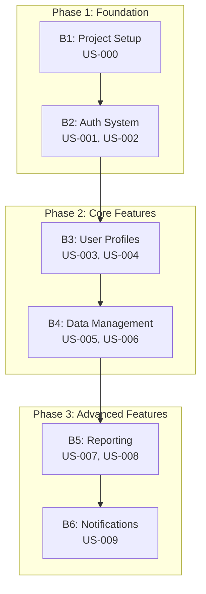

# USS-to-B1 Transformation Guide

## Overview

This guide provides a comprehensive approach for transforming User Story Suites (USS) into sequential B1 branches for implementation. The USS-to-B1-Series Method is a core pattern in SS5 that optimizes implementation by creating a logical progression of branches, each delivering tangible value while building toward the complete MVP.

## Why USS-to-B1 Transformation?

The USS-to-B1-Series Method addresses several key challenges in MVP development:

1. **Complexity Management**: Breaking down a full USS into sequential branches makes implementation more manageable
2. **Incremental Value Delivery**: Each B1 branch delivers deployable value
3. **Pattern Emergence**: Allows patterns to emerge naturally during implementation rather than being prescribed upfront
4. **Predictable Progress**: Creates clear milestones for tracking implementation progress
5. **Optimized CAI-A Collaboration**: Better aligns with CAI-A's ability to handle complexity in bounded contexts

## Transformation Process

### Phase 1: USS Analysis and Qualification

1. **Calculate USS Complexity Metrics**
   - Apply S4 Complexity Metrics 
   - Calculate stories per actor (target: 1.5-2.5)
   - Measure acceptance criteria average (target: 4.0-6.0)
   - Evaluate integration points

2. **Perform Dependency Analysis**
   - Identify technical foundation requirements
   - Map story dependencies
   - Isolate critical path stories

3. **Assess USS Architecture**
   - Evaluate overall architectural coherence
   - Identify potential for linear B1 progression
   - Assess technical foundation stories

### Phase 2: Story Refinement for B1 Alignment

1. **Enhance Technical Context**
   - Add specific implementation notes
   - Clarify acceptance criteria
   - Include validation requirements

2. **Apply Complexity Management Strategies**
   - Decompose complex stories
   - Create clear component boundaries
   - Define explicit interfaces

3. **Optimize for Sequential Implementation**
   - Reorganize stories for linear progression
   - Create clear dependencies between stories
   - Ensure each story group offers deployable value

### Phase 3: Branch Boundary Identification

1. **Identify Natural Feature Boundaries**
   - Group related user stories
   - Map logical feature boundaries
   - Identify deployment unit candidates

2. **Apply Branch Sizing Guidelines**
   - Each branch should be completable in 1-3 days
   - Each branch should have clear completion criteria
   - Each branch should deliver testable functionality

3. **Validate Branch Viability**
   - Verify each branch can function independently
   - Assess testability of each branch
   - Confirm deployment readiness

### Phase 4: Pattern Chain Creation

1. **Create Visual Branch Progression**
   - Use Mermaid diagram to visualize implementation flow
   - Define phases of implementation
   - Map stories to branches

2. **Define Branch Interfaces**
   - Identify dependencies between branches
   - Define explicit interfaces between branches
   - Document assumptions for each branch

3. **Document Implementation Sequence**
   - Specify branch order
   - Document branch prerequisites
   - Define completion criteria

## Mermaid Pattern Chain Creation

Mermaid diagrams are used to visually represent the flow and dependencies between branches. Here's how to create them:



Guidelines for creating effective Mermaid pattern chains:

1. **Group Branches Logically**: Use subgraphs to group related branches
2. **Show Clear Progression**: Make dependencies explicit with arrows
3. **Include US References**: Map user stories to each branch
4. **Name Branches Descriptively**: Use clear, functional descriptions
5. **Keep It Simple**: Focus on the critical path, avoid excessive detail

## Branch Specification Format

Each branch in the implementation plan should have a detailed specification:

```markdown
## B1: Project Setup

**User Stories Implemented:**
- US-000: Project Bootstrap

**Prerequisites:**
- None

**Deliverables:**
- Next.js project with Tailwind and TypeScript
- Basic layout components
- CI/CD pipeline configuration
- Environment setup

**Completion Criteria:**
- Project builds successfully
- Passes linting and type checking
- Deploys to preview environment
- Basic layout renders correctly

**Implementation Patterns:**
- PROJECT-INIT (Draft)
- LAYOUT-STRUCTURE (Draft)
```

## HealthBench Example

The HealthBench USS demonstrates a complete USS-to-B1 transformation:

### Phase 1: Foundation
- **B1**: Project Setup (US-000)
- **B2**: Authentication (US-001, US-002)

### Phase 2: Core Features 
- **B3**: User Profile (US-003)
- **B4**: Health Metrics (US-004, US-005)
- **B5**: Data Import (US-006)

### Phase 3: Analysis and Reporting
- **B6**: Data Visualization (US-007)
- **B7**: Health Scores (US-008)
- **B8**: Reporting System (US-009)
- **B9**: Recommendations (US-010)

See the complete implementation in `/kb/docs/ss5-train-new-thread/HealthBench-US-Suite-v4.md`.

## Best Practices

1. **Start Small**: Initial branches should establish technical foundations
2. **Consistent Size**: Maintain similar complexity across branches
3. **Value Focus**: Each branch should deliver tangible user value
4. **Clear Interfaces**: Define explicit interfaces between branches
5. **Pattern Emergence**: Allow patterns to emerge rather than prescribing them
6. **Documentation Balance**: Document enough to guide without overspecifying
7. **Verification Planning**: Include verification steps for each branch

## Tools and Templates

### USS Analysis Tool

To analyze story complexity and dependencies, use:

```bash
./ss5/tools/uss-analysis.sh [path-to-uss-file]
```

### B1 Branch Generator

To generate branch specifications from a USS:

```bash
./ss5/tools/b1-branch-plan.sh [path-to-uss-file] [output-directory]
```

### Mermaid Generator

To create a Mermaid diagram from a branch plan:

```bash
./ss5/tools/mermaid-chain.sh [path-to-branch-plan] [output-file]
```

## Conclusion

The USS-to-B1-Series Method transforms a User Story Suite into an actionable, sequential implementation plan. By breaking the implementation into manageable branches with clear dependencies, the method optimizes development flow while promoting pattern emergence through implementation. 