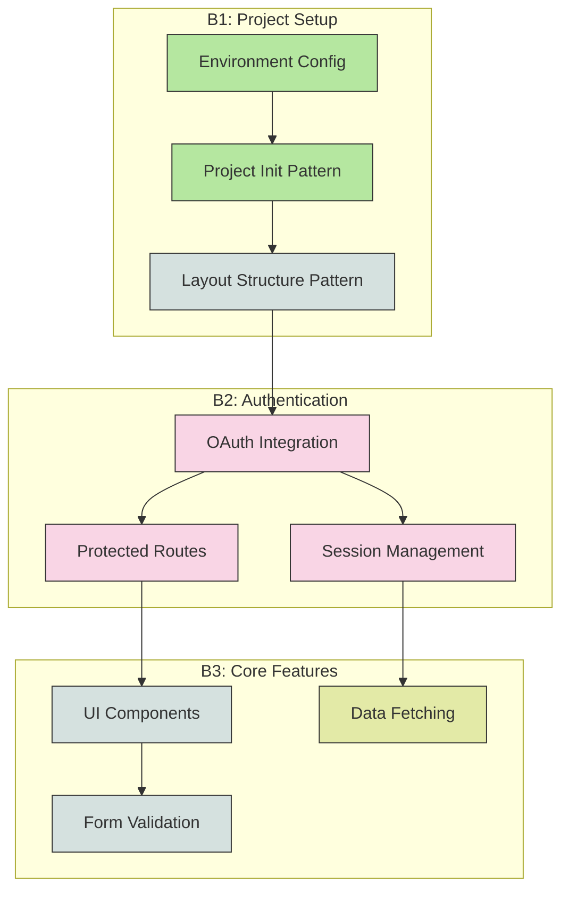
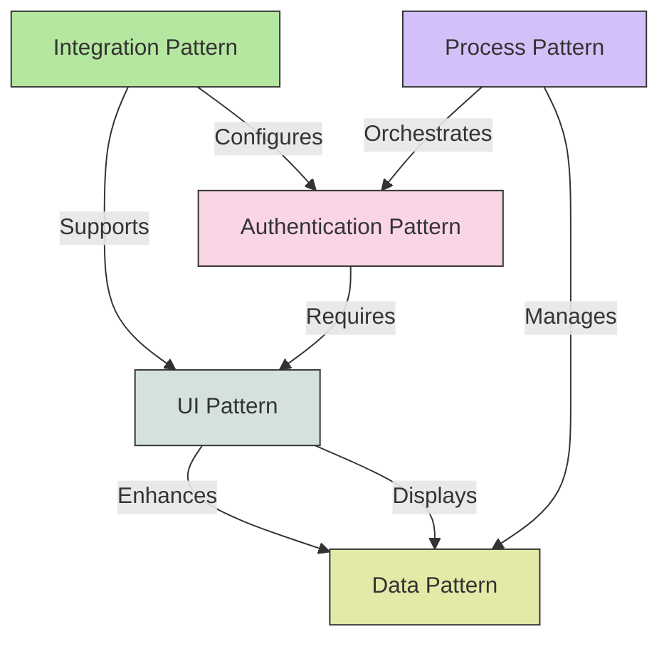
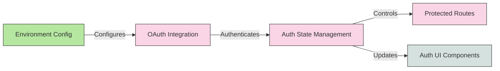
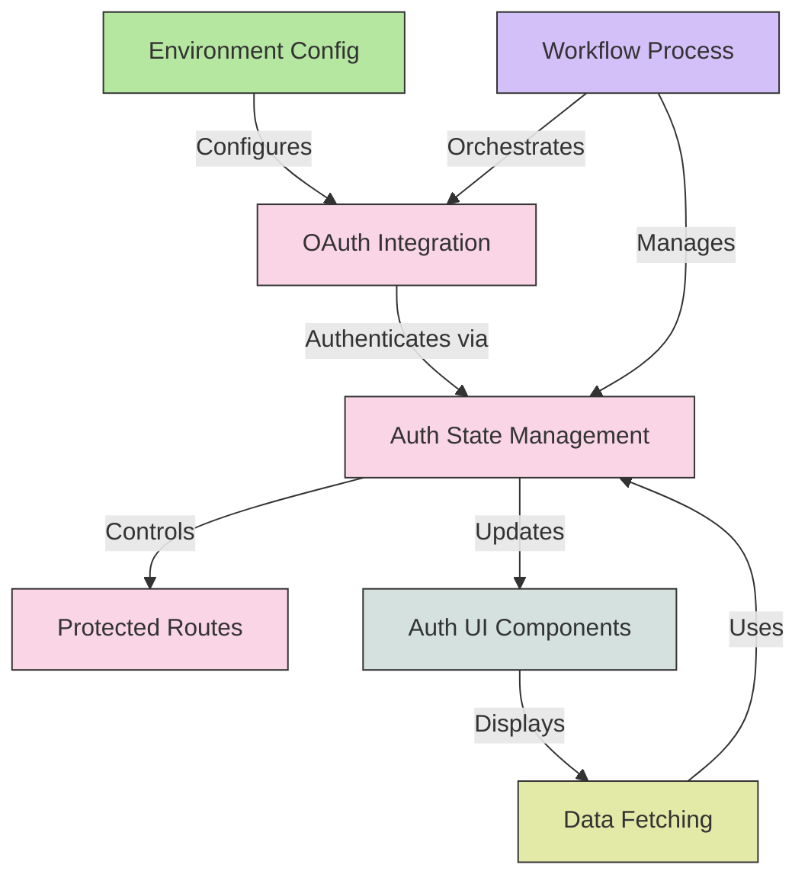
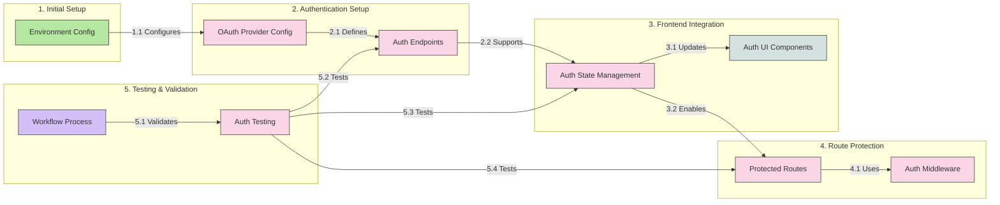
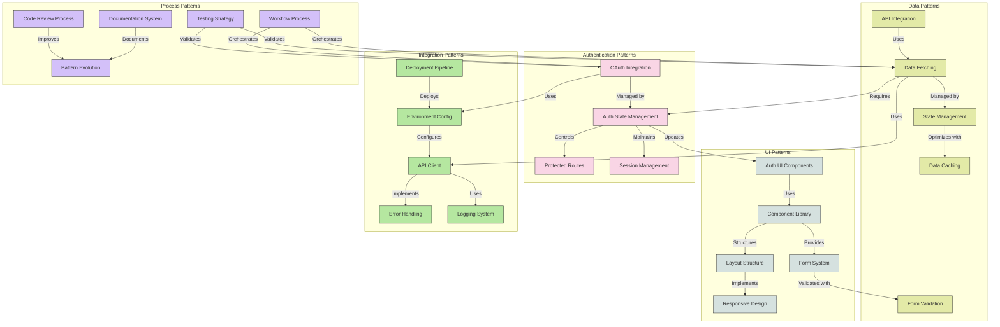
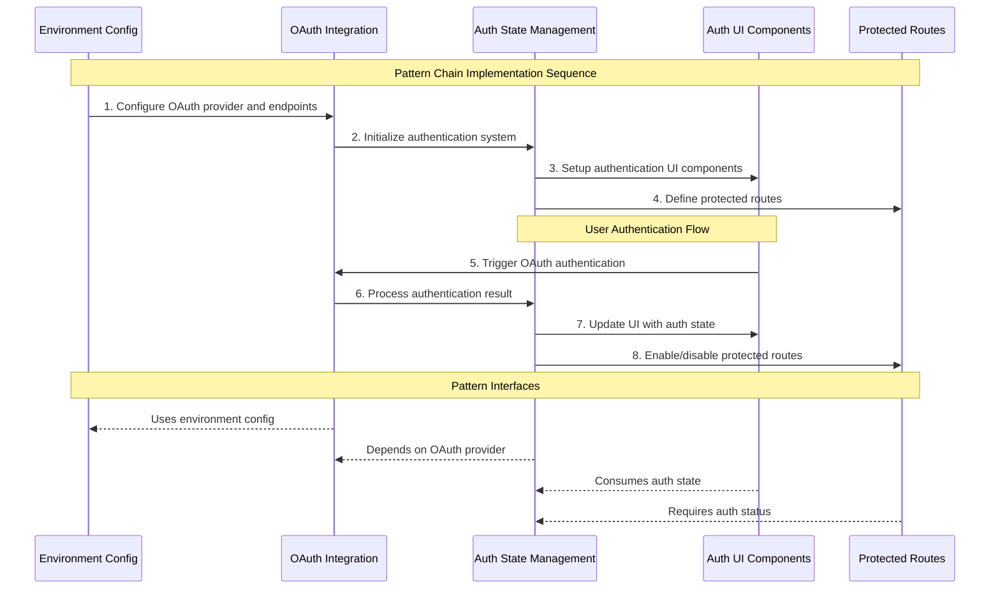

# SmartStack v5 (SS5) Specification - Pattern Meta Catalog

## Overview
SmartStack v5 (SS5) is a development framework designed for efficient MVP development using AI-assisted development tools, particularly Cursor AI. The framework integrates Branch-First workflow (B1) principles and is designed to support the implementation of any User Story Suite (USS) through the creation, documentation, and reuse of patterns. This updated specification incorporates lessons learned from implementing the HealthBench (HB) project and refines the pattern stewardship approach.

## Core Principles

### 1. AI-First Development
- Leverage CursorAI for development tasks
- Maintain clear context across threads
- Use structured prompts following SS5-B1 format
- Document decisions and patterns in knowledge base

### 2. Branch-First (B1) Workflow
- Create dedicated branches before any code changes
- Isolate changes to single features or fixes
- Deploy and verify in preview environments
- Document changes with conventional commits
- Maintain consistent workflow across all development

### 3. Story-Driven Development
- Follow the project-specific User Story Suite (USS) implementation sequence
- Adhere to clearly defined acceptance criteria
- Implement stories in dependency order
- Document pattern discoveries during implementation

### 4. Context Management
- Update current story focus in thread training document
- Document successful patterns in `kb/patterns/`
- Maintain implementation status in project-specific status document (e.g., `SAAS_TEMPLATE_STATUS.md` or `HEALTHBENCH_STATUS.md`)
- Preserve context across multiple AI assistance threads

### 5. Complexity Management
- Track story suite metrics
- Maintain pattern catalog
- Document architectural decisions
- Implement optimization strategies

### 6. Pattern Stewardship
- Identify, document, and qualify reusable patterns
- Synthesize meta patterns into project-specific pattern chains
- Track pattern usage, adaptations, and success metrics
- Evolve patterns based on implementation feedback
- Create pattern prompt chains for efficient implementation

## USS-to-B1-Series Method

The USS-to-B1-Series Method is a core methodology in SS5 that transforms User Story Suites (USS) into sequential B1 branches for implementation. This methodology addresses the gap between theoretical USS definition and practical implementation through branch sequencing.

### Key Principles of USS-to-B1-Series Method

1. **USS-First Engineering**: Prioritize highly engineered User Story Suites as the foundation
2. **Sequential Branch Implementation**: Transform USS into a series of logically sequenced B1 branches
3. **Incremental Value Delivery**: Ensure each branch delivers deployable value
4. **Pattern Emergence Through Implementation**: Allow patterns to emerge naturally during implementation
5. **Branch Size Optimization**: Create branches with appropriate scope for efficient implementation

### USS-to-B1 Transformation Process

The transformation process consists of four key phases:

#### 1. USS Analysis and Qualification
- Apply S4 Complexity Metrics to evaluate USS viability
- Perform dependency analysis to identify critical paths
- Assess USS architecture and potential for linear progression

#### 2. Story Refinement for B1 Alignment
- Enhance technical context in user stories
- Apply complexity management strategies
- Optimize stories for sequential implementation

#### 3. Branch Boundary Identification
- Identify natural feature boundaries for branch separation
- Apply branch sizing guidelines (1-3 days of work per branch)
- Validate branch viability for independent functionality

#### 4. Pattern Chain Creation
- Create visual branch progression using Mermaid diagrams
- Define interfaces between branches
- Document implementation sequence with clear prerequisites

### Branch Specification Format

Each branch in the implementation plan has a detailed specification:

```markdown
## B1: Project Setup

**User Stories Implemented:**
- US-000: Project Bootstrap

**Prerequisites:**
- None

**Deliverables:**
- Next.js project with Tailwind and TypeScript
- Basic layout components
- CI/CD pipeline configuration
- Environment setup

**Completion Criteria:**
- Project builds successfully
- Passes linting and type checking
- Deploys to preview environment
- Basic layout renders correctly

**Implementation Patterns:**
- PROJECT-INIT (Draft)
- LAYOUT-STRUCTURE (Draft)
```

### Benefits of USS-to-B1-Series Method

1. **Complexity Management**: Breaking down a full USS into sequential branches makes implementation more manageable
2. **Incremental Value Delivery**: Each branch provides deployable functionality
3. **Pattern Discovery**: Facilitates organic pattern discovery during implementation
4. **Progress Tracking**: Creates clear milestones for tracking implementation progress
5. **CAI-A Optimization**: Aligns with CAI-A's ability to handle complexity in bounded contexts

### Relationship to Pattern Stewardship

The USS-to-B1-Series Method complements the Pattern Stewardship approach by:

1. **Practical Pattern Discovery**: Patterns emerge through actual implementation
2. **Use-Case Driven Documentation**: Pattern documentation focuses on observed solutions
3. **Implementation-Based Evolution**: Patterns evolve based on practical application
4. **Natural Chain Formation**: Pattern chains form as branch relationships are established

### Reference Implementation: HealthBench

The HealthBench USS provides a reference implementation of the USS-to-B1-Series Method, featuring:

- 9 sequential branches from foundation to completion
- Clear branch dependencies and prerequisites
- Incremental value delivery at each stage
- Natural pattern emergence and documentation
- Effective CAI-A collaboration throughout implementation

See `/kb/docs/ss5-train-new-thread/HealthBench-US-Suite-v4.md` for the complete implementation example.

## SS5 Reusable Pattern Meta Catalog

### Pattern Meta Catalog Concept
The SS5 Pattern Meta Catalog is a collection of reusable, project-agnostic patterns that can be composed and customized for specific projects. Unlike static templates, these patterns provide adaptable solutions that can be tailored to the unique requirements of each User Story Suite.

### Pattern Classification
Patterns are classified into the following categories:

1. **Authentication Patterns**
   - Hybrid Auth Flow
   - Supabase GitHub OAuth Integration
   - Protected Routes Implementation
   - Session Management

2. **UI Patterns**
   - Terminal UI Component System (HB)
   - CLI Command Registry (HB)
   - Responsive Terminal Display (HB)
   - Cursor Styled Login
   - Form Validation with Zod

3. **Data Patterns**
   - Supabase Native Queries
   - Response Caching Strategy
   - Data Fetching with TanStack Query
   - Subscription Management

4. **Integration Patterns**
   - Environment Configuration
   - Build Resilient Components
   - Resilient API Gateway
   - Vercel Deployment Configuration
   - React Snippet Integration

5. **Process Patterns**
   - SS5-B1 Workflow (CORE)
   - USS-to-B1-Series Method (CORE)
   - Timed Praise Reinforcement
   - Branch Creation Pattern
   - Pattern Documentation Workflow
   - Pattern Chain Synthesis

### Pattern Qualification Process
Patterns evolve through the following qualification states:

1. **Draft**: Initial identification and documentation
   - Basic problem statement and solution
   - Minimal implementation example
   - Limited usage metrics
   - Initial benefits identified

2. **Candidate**: Implemented in at least one project with preliminary success
   - Complete documentation with examples
   - Implementation in at least one context
   - Initial metrics collected
   - Benefits validated in one context

3. **Validated**: Successfully implemented in multiple contexts with measurable benefits
   - Comprehensive documentation
   - Implementation in 2+ contexts
   - Solid metrics demonstrating value
   - Clear benefits demonstrated consistently

4. **Adaptive**: Pattern has evolved based on implementation feedback and can be easily adapted
   - Enhanced documentation with adaptation guidelines
   - Implementation in 3+ contexts with adaptations
   - Metrics show value across different adaptations
   - Pattern interfaces clearly defined
   - Relationship to other patterns documented

5. **Core Pattern**: Essential pattern that forms the foundation of SS5 implementations
   - Exemplary documentation with extensive examples
   - Implementation in numerous contexts
   - Strong metrics showing substantial value
   - Critical to SS5 methodology
   - Forms foundation for pattern chains

The CI/CD pipeline supports this qualification process by:
- Validating pattern documentation for completeness
- Tracking pattern usage and relationships
- Calculating value scores based on status and usage
- Generating visualization of pattern relationships
- Providing metrics to inform promotion decisions

### Pattern Documentation Format
Each pattern follows a standardized documentation format:

```markdown
# Pattern: [Pattern Name]

## Status
[Draft|Candidate|Validated|Adaptive|Core] [✅ if Validated/Adaptive/Core]

## Classification
[Authentication|UI|Data|Integration|Process]

## Problem Statement
[Comprehensive description of the problem this pattern solves]

## Context
[When and where this pattern should be applied]

## Solution
[Detailed description of the pattern implementation]

## Implementation Example
```code
// Minimal code example demonstrating the pattern
```

## Benefits
- [Benefit 1 with metrics where possible]
- [Benefit 2 with metrics where possible]
- [Benefit 3 with metrics where possible]

## Limitations
[Known limitations and constraints]

## Relationships
- [Related Pattern 1]: [Relationship description]
- [Related Pattern 2]: [Relationship description]

## Pattern Interfaces
- [Interface 1]: [Description of how other patterns interact with this one]
- [Interface 2]: [Description of how other patterns interact with this one]

## Usage Metrics
- Implementation Efficiency: [X% reduction in implementation time]
- Quality Improvement: [X% reduction in defects]
- Reusability Score: [Low|Medium|High]
- Projects: [List of projects using this pattern]
- Stories: [List of user stories using this pattern]

## Evolution History
| Version | Date | Description | Changes | Notes |
|---------|------|-------------|---------|-------|
| 1.0 | YYYY-MM-DD | Initial pattern | N/A | Initial implementation in US-XXX |
| 1.1 | YYYY-MM-DD | Enhanced pattern | [Changes] | Based on feedback from US-XXX |

## References
- [ADR reference]
- [Documentation reference]
```

## Project-Specific Pattern Chains

### Pattern Chain Concept
Pattern chains are project-specific combinations of meta patterns that address the unique requirements of a User Story Suite. They provide a structured approach to implementing user stories by mapping patterns to specific implementation phases.

### Creating Pattern Chains
For each project:

1. Analyze the User Story Suite to identify required capabilities
2. Select relevant meta patterns from the SS5 Pattern Meta Catalog
3. Synthesize these patterns into project-specific pattern chains
4. Document the pattern chains in the project's knowledge base
5. Create prompt chains that guide the implementation of pattern chains

### Pattern Chain Documentation Format

```markdown
# [Project Name] Pattern Chain: [Chain Name]

## Purpose
[Description of what this pattern chain accomplishes]

## User Stories
- US-XXX: [Story title]
- US-XXX: [Story title]

## Component Patterns
1. **[Pattern Name]**
   - Classification: [Authentication|UI|Data|Integration|Process]
   - Purpose: [How this pattern contributes to the chain]
   - Adaptations: [Project-specific adaptations]

2. **[Pattern Name]**
   - Classification: [Authentication|UI|Data|Integration|Process]
   - Purpose: [How this pattern contributes to the chain]
   - Adaptations: [Project-specific adaptations]

## Implementation Sequence
1. Step 1: [Implementation step]
2. Step 2: [Implementation step]
3. Step 3: [Implementation step]

## Verification Criteria
- [Criterion 1]
- [Criterion 2]
- [Criterion 3]

## Related Pattern Chains
- [Related Chain 1]: [Relationship description]
- [Related Chain 2]: [Relationship description]
```

### Example: HealthBench CLI Interface Pattern Chain
The HealthBench project demonstrates a CLI Interface Pattern Chain that combines:
- CLI Command Registry Pattern (Core)
- Terminal UI Component System Pattern
- Responsive Terminal Display Pattern
- Environment Configuration Pattern

This pattern chain enables the creation of a command-line healthcare analytics platform with minimal need for custom implementation.

## Pattern Chain Synthesis

### Synthesis Methodology
Pattern Chain Synthesis is a systematic process for combining individual patterns into cohesive solutions for complex problems. Based on ADR-0004 and aligned with the USS-to-B1-Series Method, the synthesis process follows these key principles:

1. **Relationship Mapping**: Identifying how patterns relate to each other, including:
   - **Dependency**: When one pattern requires another
   - **Enhancement**: When one pattern improves another
   - **Composition**: When patterns can be combined for enhanced functionality
   - **Alternative**: When patterns provide different solutions to similar problems

2. **Interface Definition**: Explicitly defining how patterns interact with each other:
   - **Input/Output**: What information patterns exchange
   - **Sequence**: The order in which patterns should be applied
   - **Integration Points**: Where patterns connect in the implementation
   - **Constraints**: Limitations on pattern interactions

3. **Chain Validation**: Verifying that the pattern chain effectively addresses the intended problem:
   - **Completeness**: Ensures all requirements are covered
   - **Coherence**: Ensures patterns work together seamlessly
   - **Efficiency**: Optimizes the chain for implementation effectiveness
   - **Maintainability**: Considers long-term management of the solution

4. **Branch Alignment**: Mapping pattern chains to B1 branches:
   - **Branch Boundaries**: Aligning pattern chains with B1 branch scope
   - **Sequential Implementation**: Organizing patterns for branch-to-branch progression
   - **Incremental Value**: Ensuring each branch's pattern chain delivers value
   - **Pattern Emergence**: Accommodating new patterns discovered during implementation

### Synthesis Process
The process for creating an effective pattern chain includes:

1. **Problem Analysis**:
   - Break down the problem into distinct aspects
   - Identify specific capabilities required
   - Define constraints and requirements
   - Map to USS stories and acceptance criteria

2. **Pattern Selection**:
   - Search the Pattern Meta Catalog for relevant patterns
   - Evaluate patterns based on qualification status
   - Consider pattern relationships and dependencies
   - Select patterns that address each aspect of the problem

3. **Chain Design**:
   - Define pattern sequence and dependencies
   - Map pattern interfaces and integration points
   - Identify adaptation requirements
   - Create a visual chain representation
   - Align with B1 branch boundaries from USS-to-B1 analysis

4. **Implementation Planning**:
   - Create a step-by-step implementation sequence
   - Define verification criteria for each step
   - Document specific adaptations needed
   - Create a timeline for implementation
   - Organize according to B1 branch sequence

5. **Validation**:
   - Review the chain design against requirements
   - Identify potential conflicts or gaps
   - Verify interface compatibility
   - Assess overall chain effectiveness
   - Validate alignment with B1 branch boundaries

### Chain Documentation
Pattern chains should be documented using the standard format, with special attention to:

1. **Component Patterns**: Clearly listing all patterns with their:
   - Classification and purpose
   - Specific adaptations needed
   - Relationships to other patterns in the chain
   - Interfaces for pattern interaction

2. **Implementation Sequence**: Providing a detailed, step-by-step guide that:
   - References specific patterns at each step
   - Notes pattern-specific implementation details
   - Identifies critical integration points
   - Includes verification criteria
   - Maps to specific B1 branches in the implementation plan

3. **Chain Metrics**: Documenting expected benefits:
   - Implementation efficiency gains
   - Quality improvement metrics
   - Reusability potential
   - Complexity reduction

4. **Chain Visualization**: Including a visual representation that shows:
   - Pattern relationships and dependencies
   - Implementation sequence
   - Interface connections
   - Critical path through the chain
   - Alignment with B1 branch boundaries

### USS-to-B1 Chain Visualization

Pattern chains aligned with the USS-to-B1-Series Method can be visualized using Mermaid diagrams that show both pattern relationships and branch boundaries:



### Chain Management
Effective pattern chains require ongoing management:

1. **Version Control**: Tracking chain evolution as:
   - Component patterns evolve
   - Requirements change
   - Implementation feedback is received

2. **Chain Registry**: Maintaining a registry of successful chains:
   - Organized by problem domain
   - With usage metrics and feedback
   - Including implementation examples
   - With references to related chains

3. **Chain Refinement**: Continuously improving chains based on:
   - Implementation experience
   - Pattern evolution
   - Efficiency metrics
   - User feedback

### Pattern Chain Visualization

Pattern chains can be visualized using Mermaid diagrams to show relationships and flow:



A more specific example for an authentication flow might look like:



## Integration Patterns Enhancement: ES7+ React Snippets Integration

### React Code Snippet Integration

- **Status**: Candidate
- **Classification**: Integration
- **Problem**: Inconsistent React implementation patterns across components and projects
- **Solution**: Standardized code snippets based on the mature "ES7+ React/Redux/React-Native snippets v4.4.3" extension

The SS5 framework formally adopts and adapts selected snippets from the widely-used "ES7+ React/Redux/React-Native snippets" VSCode extension, which provides "Extensions for React, React-Native and Redux in JS/TS with ES7+ syntax. Customizable. Built-in integration with prettier."

**Key Adopted Snippets**:
- Component initialization patterns (`rafce`, `rfc`, etc.)
- Hook integration patterns (`useS`, `useE`, `useC`, etc.)
- TypeScript-specific patterns (`tsrafce`, etc.)
- Testing pattern snippets (`test`, `describe`, etc.)

These mature, community-tested snippets are formalized as SS5 implementation patterns to ensure consistent component structure, naming, and organization across projects.

**Benefits**:
- Consistent component creation across SS5 projects
- Reduced boilerplate code
- Standard hook usage patterns
- Prettier integration for code formatting
- Typescript-first approach

## Process Patterns Enhancement: SS5-B1 as Core Meta-Pattern

### SS5-B1 Workflow

- **Status**: Core Pattern ✅ 
- **Classification**: Process
- **Problem**: Inconsistent development workflows leading to context switching, deployment issues, and maintenance challenges
- **Solution**: The SS5-B1 workflow is THE DEFINING FOUNDATIONAL META-PATTERN of SmartStack v5

SS5-B1 represents a comprehensive development workflow that integrates branch-first principles with AI-assisted development and pattern-based implementation. The pattern has been extensively proven and refined, with specific training documents under `/home/neo/SS4/kb/docs/3.3retrain` designed to reinforce and guide its application.

**Key Components**:
1. **Branch Creation**: Create feature/fix branches before any implementation
2. **Pattern Selection**: Identify and select applicable patterns from the catalog
3. **Pattern Chain Synthesis**: Combine patterns into effective implementation chains
4. **Implementation**: Follow prompt chains for guided, consistent implementation
5. **Documentation**: Document pattern usage, adaptations, and new patterns
6. **Verification**: Deploy changes to preview environments
7. **Pull Request**: Submit changes with proper documentation

The `.cursor.training` core B1-oriented rules provide specific guidance to ensure consistent application of this foundational pattern.

**This CORE pattern has been successfully proven in multiple projects and the progress made must be preserved as we refine SS5 and prepare to implement projects like the HealthBench User Story Suite.**

## Pattern Stewardship Plan

### Goals
- Identify and document reusable patterns across projects
- Ensure patterns evolve through the qualification process
- Create a comprehensive Meta Pattern Catalog
- Develop expertise in synthesizing pattern chains

### Responsibilities of the Pattern Steward
1. **Pattern Identification**
   - Recognize reusable solutions during implementation
   - Identify patterns in existing code
   - Determine pattern boundaries and responsibilities

2. **Pattern Documentation**
   - Create standardized documentation for each pattern
   - Include clear problem statements and contexts
   - Provide implementation examples and benefits
   - Track pattern usage and evolution

3. **Pattern Qualification**
   - Evaluate patterns against qualification criteria
   - Move patterns through qualification states
   - Track successful applications of patterns
   - Refine patterns based on implementation feedback

4. **Pattern Chain Synthesis**
   - Analyze User Story Suites for pattern requirements
   - Combine meta patterns into effective chains
   - Document pattern chains for project implementation
   - Create prompt chains for AI-assisted development

### Tools and Processes

#### Pattern Identification Checklist
- [ ] Does the solution address a common problem?
- [ ] Can the solution be abstracted from its specific context?
- [ ] Does the solution have clearly defined boundaries?
- [ ] Would the solution benefit future implementations?
- [ ] Can the solution be composed with other patterns?

#### Pattern Documentation Template
A standardized template located at `/home/neo/SS4/ss4/patterns/_template.md` ensures consistent documentation.

#### Pattern Review Process
1. Weekly pattern review sessions
2. Assessment against qualification criteria
3. Feedback collection from implementations
4. Pattern refinement and updates

#### Pattern Chain Synthesis Workshop
A structured process for creating pattern chains:
1. USS analysis to identify required capabilities
2. Meta pattern selection from the catalog
3. Pattern adaptation for project-specific needs
4. Chain documentation and prompt creation
5. Implementation validation and refinement

## Pattern-Based Project Bootstrapping

### Advantages Over Static Templates
1. **Flexibility**: Patterns can be adapted to project-specific requirements
2. **Modularity**: Only relevant patterns are applied
3. **Currency**: Patterns evolve with technology and best practices
4. **Clarity**: Each pattern addresses a specific concern with clear boundaries
5. **Composition**: Patterns can be combined to address complex requirements
6. **Sequencing**: Implementation follows logical branch-to-branch progression

### Bootstrapping Process

#### 1. User Story Suite Analysis
- Identify project requirements from User Story Suite
- Determine required capabilities and technical components
- Identify dependencies between stories
- Apply USS-to-B1-Series Method for branch planning
- Create Mermaid diagram of branch progression

#### 2. Pattern Selection
- Select relevant patterns from the Meta Pattern Catalog
- Identify gaps requiring new pattern development
- Determine pattern adaptation requirements
- Map patterns to specific B1 branches
- Define pattern interfaces between branches

#### 3. Pattern Chain Synthesis
- Create project-specific pattern chains
- Document implementation sequence
- Develop prompt chains for AI-assisted implementation
- Align chains with B1 branch boundaries
- Define clear hand-offs between branches

#### 4. Implementation
- Follow USS-to-B1-Series branch sequence
- Use prompt chains to guide implementation
- Document pattern adaptations and new patterns
- Validate pattern chain effectiveness
- Deploy each branch to preview environment

#### 5. Pattern Feedback
- Evaluate pattern effectiveness in implementation
- Document adaptation requirements and challenges
- Propose refinements to meta patterns
- Identify new pattern candidates
- Update pattern chains based on implementation experience

### Bootstrap Script Generation
For each project, create an automated bootstrap script that:
1. Sets up the basic project structure
2. Implements core patterns from selected pattern chains
3. Configures development environment and tools
4. Initializes documentation and knowledge base

Example: `/home/neo/SS4/bootstrap-us000.sh` for HealthBench provides:
- Project structure setup
- Terminal UI components implementation
- Command registry system
- Environment configuration
- Deployment setup

## Architectural Decisions

SS5 has established the following architectural decisions:

### 1. Pattern Stewardship Framework (ADR-0001)
- Enhanced Pattern Meta Catalog for reusable patterns
- Pattern-Based Development System
- Pattern Chain Synthesis
- Pattern qualification process (Draft → Candidate → Validated → Adaptive → Core)
- Pattern usage metrics and feedback loop

### 2. Thread Training System (ADR-0002)
- Core Training Curriculum
- Practical Training Workflow
- Assessment and Certification
- Knowledge Transfer Process
- Thread Onboarding Process

### 3. Documentation Organization System (ADR-0003)
- Directory Structure for Documentation
- Documentation Standards
- Navigation System
- Documentation Maintenance Process
- Cross-Reference System

### 4. Pattern Chain Synthesis System (ADR-0004)
- Pattern Chain Framework
- Synthesis Process
- Chain Management
- Pattern Relationship Mapping
- Interface Definition

### 5. Pattern Meta Catalog System (ADR-0005)
- Pattern Discovery and Documentation
- Pattern Management
- Pattern Evolution
- Pattern Qualification Process
- Pattern Metrics Framework

### 6. Pattern-Based Development System (ADR-0006)
- Implementation Framework
- Development Process
- Pattern Management
- Quality Assurance
- Continuous Improvement

### 7. USS-to-B1-Series Method (ADR-006)
- USS Analysis and Qualification
- Story Refinement for B1 Alignment
- Branch Boundary Identification
- Pattern Chain Creation
- Sequential Implementation Process

### 8. Lightweight CI/CD System
- Automated pattern validation and documentation
- Pattern chain visualization with Mermaid diagrams
- Comprehensive metrics collection and reporting
- Git hooks integration for quality enforcement
- Structured prompting system for workflow guidance

## Documentation Organization System

The SS5 Documentation Organization System, as defined in ADR-0003, provides a structured approach to organizing and maintaining documentation.

### Directory Structure

SS5 documentation is organized into specific directories for clarity and accessibility:

1. **Foundation Directory** (`/kb/docs/ss5-foundation/`)
   - Core architectural and foundational documents
   - Architectural Decision Records (ADRs)
   - Implementation guidelines and plans
   - Pattern application guidelines
   - Workflow guides

2. **Training Directory** (`/kb/docs/ss5-train-new-thread/`)
   - Thread training materials
   - Onboarding guides
   - Thread management documentation
   - Optimization guidelines
   - Training exercises

3. **Pattern Catalog** (`/ss5/patterns/`)
   - Categorized pattern documentation
   - Pattern templates
   - Pattern qualification tracking
   - Pattern relationship documentation

4. **Pattern Chains** (`/ss5/chains/`)
   - Project-specific pattern chains
   - Chain templates
   - Chain visualization
   - Implementation sequences

5. **Architectural Decision Records** (`/kb/ADR/`)
   - Core architectural decisions
   - Numbered and versioned
   - Cross-referenced from other documentation

### Documentation Standards

SS5 establishes consistent documentation standards:

1. **Naming Conventions**
   - Lowercase with hyphens for filenames
   - Clear, descriptive titles
   - Numbered ADRs (ADR-NNNN-title)
   - Consistent prefixes (ss5-*)

2. **File Formats**
   - Markdown for all documentation
   - Mermaid for diagrams
   - Code blocks for examples
   - Tables for structured data

3. **Cross-Referencing**
   - Absolute paths for stable references
   - Related document sections in each document
   - Reference tables for major documents
   - Consistent link formatting

4. **Versioning**
   - Version history in each document
   - Last updated dates
   - Change summaries
   - Author tracking for major changes

### Navigation System

SS5 provides a comprehensive navigation system:

1. **Index Files**
   - README.md in each directory
   - Document categorization
   - Quick access links
   - Directory structure documentation

2. **Document Hierarchies**
   - Clear parent-child relationships
   - Topic grouping
   - Logical progression
   - Consistent formatting

3. **Cross-Directory References**
   - Links between related documents
   - Reference tables
   - See-also sections
   - Contextual navigation

### Documentation Maintenance

SS5 establishes processes for maintaining documentation quality:

1. **Review Process**
   - Regular documentation reviews
   - Feedback collection
   - Quality metrics
   - Update tracking

2. **Update Workflow**
   - Change logging in doc-log.md
   - Version history updates
   - Cross-reference verification
   - Archive process for outdated documents

3. **Quality Assurance**
   - Documentation testing
   - Link validation
   - Consistency checking
   - Readability assessment

## Thread Training System

The SS5 Thread Training System, as defined in ADR-0002, provides a structured approach for training new CursorAI Agent (CAI-A) threads.

### Core Training Curriculum

The training curriculum includes:

1. **SS5 Architecture Overview**
   - Pattern Meta Catalog concept
   - Pattern Chain Synthesis
   - Pattern-Based Development
   - Documentation Organization
   - Workflow Processes

2. **Pattern-Based Development Fundamentals**
   - Pattern identification
   - Pattern application
   - Pattern adaptation
   - Pattern documentation
   - Pattern chain creation

3. **Documentation Standards and Practices**
   - Documentation organization
   - File naming conventions
   - Cross-referencing
   - Versioning
   - Maintenance

4. **Pattern Application Guidelines**
   - Pattern selection
   - Implementation sequence
   - Verification criteria
   - Adaptation strategies
   - Chain implementation

5. **Pattern Chain Synthesis Principles**
   - Problem decomposition
   - Pattern selection
   - Chain design
   - Interface definition
   - Chain validation

### Practical Training Workflow

The practical training process includes:

1. **Guided Pattern Application**
   - Selecting patterns for specific problems
   - Implementing patterns according to documentation
   - Adapting patterns to specific requirements
   - Documenting pattern usage and adaptations
   - Validating pattern implementation

2. **Documentation Review and Updates**
   - Reviewing existing documentation
   - Identifying areas for improvement
   - Making documentation updates
   - Ensuring cross-references are maintained
   - Validating documentation quality

3. **Pattern Synthesis Projects**
   - Analyzing complex problems
   - Creating pattern chains
   - Documenting implementation sequence
   - Implementing pattern chains
   - Evaluating chain effectiveness

4. **Code Review Participation**
   - Reviewing pattern implementations
   - Providing feedback on pattern application
   - Suggesting pattern improvements
   - Identifying new pattern candidates
   - Evaluating pattern effectiveness

5. **Knowledge Transfer Sessions**
   - Sharing implementation experiences
   - Discussing pattern adaptations
   - Collaborating on pattern chain synthesis
   - Contributing to pattern evolution
   - Documenting lessons learned

### Assessment and Certification

Thread training includes assessment through:

1. **Knowledge Checkpoints**
   - Architecture understanding
   - Pattern comprehension
   - Workflow process knowledge
   - Documentation standards
   - Implementation principles

2. **Practical Application Tests**
   - Pattern selection exercises
   - Implementation challenges
   - Pattern adaptation tasks
   - Chain synthesis projects
   - Documentation creation

3. **Documentation Quality Reviews**
   - Content accuracy
   - Formatting consistency
   - Cross-reference validity
   - Clarity and completeness
   - Organization adherence

4. **Pattern Synthesis Demonstrations**
   - Problem analysis
   - Pattern selection
   - Chain design
   - Implementation planning
   - Solution validation

5. **Peer Review Feedback**
   - Implementation quality
   - Documentation contributions
   - Pattern adaptations
   - Collaboration effectiveness
   - Knowledge sharing

### Thread Management

Effective thread management includes:

1. **Thread Lifecycle Management**
   - Initialization
   - Training
   - Active implementation
   - Specialization
   - Retirement

2. **Context Management**
   - Project context tracking
   - Current story focus
   - Pattern knowledge transfer
   - Implementation history
   - Decision tracking

3. **Performance Metrics**
   - Implementation efficiency
   - Pattern application quality
   - Documentation contributions
   - Knowledge transfer effectiveness
   - Collaboration metrics

4. **Continuous Improvement**
   - Regular training updates
   - Skill development
   - Specialization opportunities
   - Performance reviews
   - Feedback incorporation

### Training Materials

The SS5 training system utilizes dedicated resources:

1. **Core Training Documents**
   - SS5 Thread Training Guide
   - Thread Management Guide
   - Optimization Guide
   - Pattern Application Guidelines
   - Chain Synthesis Guide

2. **Practical Exercises**
   - Pattern identification exercises
   - Pattern application scenarios
   - Chain synthesis challenges
   - Documentation tasks
   - Code review exercises

3. **Reference Materials**
   - Pattern Meta Catalog
   - ADR documentation
   - Implementation examples
   - Workflow guides
   - Best practices documentation

4. **Assessment Tools**
   - Knowledge checkpoints
   - Practical tests
   - Quality reviews
   - Synthesis evaluations
   - Peer review forms

## Updated Project Structure

```
SS4/
├── [project]/                  # Project-specific directory (e.g., p1.1, hb)
│   ├── app/                    # Next.js application
│   ├── components/             # UI components
│   ├── lib/                    # Utility libraries
│   ├── docs/                   # Project documentation
│   └── public/                 # Static assets
├── kb/                         # Knowledge base
│   ├── docs/                   # Documentation
│   │   ├── 3.3retrain/         # Project-specific documentation
│   │   │   ├── HealthBench-US-Suite-v4.md      # USS definition
│   │   │   ├── healthbench-us000-setup-guide.md # Setup guide
│   │   │   ├── healthbench-us000-prompt-chain.md # Prompt chain
│   │   │   ├── healthbench-us001-prompt-chain.md # Prompt chain
│   │   │   └── ss4-patterns-reference.md        # Pattern reference
│   │   └── smartstack-v5-spec.md # This specification
│   └── ADR/                    # Architectural decisions
│       ├── ADR-0001-pattern-stewardship-framework.md
│       └── ADR-0006-pattern-based-development.md
├── ss5/                        # SmartStack v5 infrastructure
│   ├── patterns/               # Pattern catalog
│   │   ├── authentication/     # Auth-related patterns
│   │   ├── ui/                 # UI patterns
│   │   ├── data/               # Data patterns
│   │   ├── integration/        # Integration patterns
│   │   └── _template.md        # Pattern documentation template
│   ├── chains/                 # Pattern chains
│   │   ├── _template.md        # Chain documentation template
│   │   ├── p1.1/               # P1.1 pattern chains
│   │   └── hb/                 # HealthBench pattern chains
│   └── scripts/                # Utility scripts
└── bootstrap-scripts/          # Project bootstrap scripts
    ├── bootstrap-p1.1.sh       # P1.1 bootstrap script
    └── bootstrap-us000.sh      # HealthBench bootstrap script
```

## Solopreneur (S) Responsibilities

### Pattern Stewardship
- Identify reusable patterns during implementation
- Document patterns following standardized format
- Synthesize patterns into project-specific chains
- Track pattern usage and effectiveness
- Evolve patterns through qualification process

### Implementation
- Follow SS5-B1 workflow consistently
- Apply appropriate pattern chains to user stories
- Document pattern adaptations and extensions
- Provide feedback on pattern effectiveness

### Documentation
- Maintain Pattern Meta Catalog
- Create project-specific pattern chains
- Update implementation status documents
- Create prompt chains for AI-assisted development

## CursorAI Agent Prompting Guidelines

### Pattern-Specific Prompts
- Request pattern recommendations for specific problems
- Ask for pattern chain synthesis for user stories
- Request prompt chains for pattern implementation
- Provide feedback on pattern effectiveness

### Pattern Documentation Prompts
- Request documentation for newly identified patterns
- Ask for pattern qualification assessment
- Request pattern refinement based on implementation
- Ask for pattern chain creation for specific user stories

### Pattern Implementation Prompts
- Follow the prompt chains for pattern implementation
- Request step-by-step guidance for pattern application
- Ask for help adapting patterns to specific requirements
- Request verification of pattern implementation

## Implementation Guidelines for New Projects

### 1. User Story Suite Analysis
- Identify project requirements and capabilities
- Determine implementation sequence
- Identify potential pattern applications

### 2. Pattern Chain Synthesis
- Select appropriate patterns from Meta Catalog
- Create project-specific pattern chains
- Develop prompt chains for implementation

### 3. Project Bootstrapping
- Create bootstrap script for initial setup
- Implement core patterns and project structure
- Configure development environment

### 4. Story Implementation
- Follow the SS5-B1 workflow
- Use prompt chains for guided implementation
- Document pattern adaptations and new patterns

### 5. Pattern Feedback
- Evaluate pattern effectiveness
- Document adaptations and challenges
- Propose refinements to patterns
- Identify new pattern candidates

## HealthBench Project Implementation

The HealthBench (HB) project demonstrates the pattern-based approach to project implementation:

### Key Pattern Chains
1. **CLI Interface Chain**
   - CLI Command Registry Pattern (Core)
   - Terminal UI Component System Pattern
   - Responsive Terminal Display Pattern
   - Environment Configuration Pattern

2. **Authentication Chain**
   - Supabase GitHub OAuth Integration Pattern
   - Hybrid Auth Flow Pattern
   - CLI Authentication Commands Pattern
   - Authentication State Management Pattern

### Implementation Approach
- US-000 establishes the CLI-focused template
- US-001 adds GitHub OAuth authentication
- US-002 enhances the command parser
- Additional stories build on this foundation

### Pattern Documentation
- Core patterns documented in ss4-patterns-reference.md
- Pattern chains documented in prompt chain files
- Implementation guided by bootstrap script

## Technical Stack

### Frontend
- Next.js 15.2.3 (App Router)
- TypeScript 5.4.3
- Tailwind CSS 3.4.1 with Cursor AI Design System
- shadcn/ui components
- lucide-react 0.363.0 for icons

### Authentication and Database
- Supabase Auth Helpers 0.9.2
- Supabase JS 2.39.7
- Native Supabase query API (no ORM)

### Data Fetching and State Management
- TanStack Query 5.27.2
- TanStack Query DevTools 5.27.2

### Form Handling and Validation
- React Hook Form 7.51.1
- Zod 3.22.4
- hookform/resolvers 3.3.4

### Testing
- Jest 29.7.0
- React Testing Library 14.2.1
- Testing Library Jest DOM 6.4.2
- Jest Environment JSDOM 29.7.0

### Development
- ESLint 8.57.0
- ESLint Config Next 15.2.3
- TypeScript ESLint Plugin 7.2.0
- TypeScript ESLint Parser 7.2.0
- ESLint Plugin React 7.34.0
- ESLint Plugin React Hooks 4.6.0
- Git for version control
- Vercel for deployment

## Installation Commands

```bash
# Create Next.js project with the right configurations
npx create-next-app@15.2.3 . --typescript --tailwind --eslint --app

# Install authentication dependencies
npm install @supabase/auth-helpers-nextjs@0.9.2 @supabase/supabase-js@2.39.7

# Install data fetching
npm install @tanstack/react-query@5.27.2 @tanstack/react-query-devtools@5.27.2

# Install form handling
npm install react-hook-form@7.51.1 @hookform/resolvers@3.3.4 zod@3.22.4

# Install UI components
npm install lucide-react@0.363.0
npx shadcn-ui@0.8.0 init

# Install testing tools
npm install -D jest@29.7.0 @testing-library/react@14.2.1 @testing-library/jest-dom@6.4.2 jest-environment-jsdom@29.7.0

# Install ESLint plugins
npm install -D eslint@8.57.0 eslint-config-next@15.2.3 @typescript-eslint/eslint-plugin@7.2.0 @typescript-eslint/parser@7.2.0 eslint-plugin-react@7.34.0 eslint-plugin-react-hooks@4.6.0
```

## Success Metrics

### Pattern Effectiveness
- Number of patterns successfully reused
- Adaptation effort required for patterns
- Pattern qualification progression
- Implementation time savings

### Implementation Efficiency
- Reduced development time through pattern reuse
- Consistency across implementations
- Reduction in redundant code
- Improved code quality and maintainability

### Knowledge Transfer
- Pattern documentation quality
- Pattern chain synthesis efficiency
- Successful application by different developers
- Reduced onboarding time for new projects

## Version History
- v5.0: Pattern Meta Catalog and Chain Synthesis (Apr)
- v4.5: HealthBench Pattern Integration (Apr)
- v4.4: Dependency Versions and ORM Strategy (Mar)
- v4.3: Pattern Stewardship and ADR Integration (Mar)
- v4.2: SS4-B1 workflow integration (Mar)
- v4.1: P1.1 Story Suite alignment (Mar)
- v4.0: Initial SmartStack v4 with AI-assisted development (Feb)

## Implementation Guidance

This section provides practical guidance for implementing SS5 in new projects, focusing on the pattern-based approach that defines SmartStack v5.

### Implementation Workflow

The SS5 implementation workflow follows these steps:

1. **Requirements Analysis**
   - Review User Story Suite requirements
   - Identify key capabilities needed
   - Document non-functional requirements

2. **Pattern Selection**
   - Search Pattern Meta Catalog for relevant patterns
   - Evaluate pattern qualification status
   - Select patterns based on requirements and compatibility

3. **Pattern Chain Synthesis**
   - Create project-specific pattern chains
   - Document component patterns and adaptations
   - Define implementation sequence

4. **Bootstrap Script Generation**
   - Generate bootstrap script based on pattern chains
   - Customize for project-specific requirements
   - Prepare environment and dependency list

5. **Pattern Implementation**
   - Execute bootstrap script to set up project
   - Follow implementation sequence from pattern chains
   - Document pattern adaptations and new patterns

6. **Verification**
   - Validate against pattern chain verification criteria
   - Test implementation against user story requirements
   - Document any pattern refinements

### CI/CD Integration

SS5 includes a lightweight CI/CD pipeline that automates pattern validation, documentation generation, and metrics collection. The system enhances the Pattern Stewardship Framework with automated tooling while keeping implementation straightforward and maintainable.

#### Core Pipeline Components

1. **Validation Job**
   - Validates pattern files for required sections and format
   - Ensures correct status values and classifications
   - Verifies YAML frontmatter presence and correctness
   - Checks for code examples and minimum content length

2. **Pattern Chain Validation Job**
   - Validates pattern chain files for required sections
   - Ensures referenced patterns exist in the catalog
   - Verifies implementation sequences and verification criteria
   - Maintains consistency with the pattern catalog

3. **Metrics Job**
   - Generates comprehensive pattern and chain metrics
   - Tracks pattern status and classification statistics
   - Measures pattern value scores based on usage and status
   - Produces metrics reports for analysis

4. **Visualization Job**
   - Generates visual diagrams for pattern chains
   - Creates color-coded Mermaid.js diagrams
   - Produces individual chain visualizations
   - Creates overview diagrams showing all pattern chains

5. **Documentation Job**
   - Generates comprehensive pattern documentation
   - Creates pattern catalog with status summaries
   - Builds chain documentation with visualizations
   - Deploys documentation to GitHub Pages

#### Integration with Pattern Development

The CI/CD system integrates with pattern-based development through:

1. **Git Hooks**
   - Pre-commit hooks validate pattern documentation
   - Pre-push hooks update documentation and metrics
   - Automated dependency installation for validation tools
   - Quality enforcement for pattern documentation

2. **Structured Prompting System**
   - CLI tool for workflow-specific prompts
   - Prompt library categorized by workflow stage
   - Context-aware prompt suggestions
   - Feedback loop for prompt refinement

3. **Documentation Deployment**
   - Automated GitHub Pages deployment
   - Interactive documentation with visualizations
   - Real-time metrics display
   - Responsive design for all devices

4. **Metrics and Analysis**
   - Pattern usage tracking
   - Qualification status progression
   - Value score calculation
   - Chain effectiveness metrics

#### Usage Guidelines

To effectively use the CI/CD system in SS5 development:

1. **For Pattern Documentation**
   - Ensure pattern files follow the standard format
   - Include all required sections and YAML frontmatter
   - Provide code examples and comprehensive content
   - Reference related patterns correctly

2. **For Chain Development**
   - Document chains using the standard template
   - Reference existing patterns from the catalog
   - Define clear implementation sequences
   - Include verification criteria

3. **For Documentation Review**
   - Access generated documentation on GitHub Pages
   - Review pattern metrics and visualizations
   - Use metrics to identify patterns for promotion
   - Monitor pattern usage and effectiveness

4. **For Continuous Improvement**
   - Use validation feedback to improve documentation
   - Leverage metrics to guide pattern evolution
   - Refine prompts based on effectiveness data
   - Contribute to the structured prompting system

### Using the Bootstrap System

The SS5 Bootstrap System automates project setup with pattern-based implementations:

```bash
# Generate bootstrap script for new project
/home/neo/SS4/ss5/scripts/generate-bootstrap.sh project-name path/to/uss output-path

# Execute bootstrap script
./bootstrap-script.sh
```

Bootstrap scripts create a consistent project structure, install dependencies, and implement pattern foundations according to the pattern chains.

### Pattern Qualification Process

SS5 introduces a formal pattern qualification process:

1. **Draft** - Initial implementation, minimal documentation
2. **Candidate** - Used in 2+ contexts, improved documentation
3. **Validated** - Used in 3+ contexts, complete documentation
4. **Core** - Essential pattern, extensively documented

Patterns evolve through this process as they are implemented and refined across projects.

### Documentation Requirements

SS5 implementations require consistent documentation:

1. **Pattern Documentation**
   - Abstract, reusable patterns in Pattern Meta Catalog
   - Clear problem statements and solutions
   - Implementation examples and limitations

2. **Pattern Chain Documentation**
   - Project-specific pattern chains
   - Adaptations for specific user stories
   - Implementation sequence and verification criteria

3. **Implementation Logs**
   - Pattern usage and adaptations
   - New pattern drafts
   - Pattern qualification updates

### Tooling and Infrastructure

SS5 provides tools to support pattern-based implementation:

1. **Pattern Meta Catalog** - `/home/neo/SS4/ss5/patterns/`
   - Categorized abstract patterns
   - Standardized documentation format
   - Qualification status tracking

2. **Pattern Chains** - `/home/neo/SS4/ss5/chains/`
   - Project-specific pattern combinations
   - Implementation sequence
   - Verification criteria

3. **Bootstrap Scripts** - `/home/neo/SS4/bootstrap-scripts/`
   - Pattern-based project setup
   - Consistent environment configuration
   - Pattern implementation foundation

4. **Synthesis Tools** - `/home/neo/SS4/ss5/scripts/`
   - Bootstrap script generation
   - Pattern analysis tools
   - Documentation generation

### Best Practices

1. **Pattern Selection**
   - Prefer patterns with higher qualification status
   - Consider pattern compatibility
   - Evaluate adaptation effort

2. **Pattern Adaptation**
   - Document adaptations in pattern chains
   - Maintain core pattern principles
   - Consider creating new patterns for significant deviations

3. **Pattern Stewardship**
   - Update pattern usage metrics
   - Document pattern refinements
   - Submit new patterns for qualification review

4. **SS5-B1 Workflow**
   - Follow branch-first approach
   - Document pattern usage in commits
   - Include pattern references in PRs

## Success Metrics 

## Appendix

### Appendix A: Pattern Chain Visualization Examples

Pattern chains can be visualized using Mermaid diagrams to show relationships, dependencies, and implementation flow. These visualizations help in understanding complex pattern interactions and planning implementation sequences.

#### Color Coding by Pattern Classification

```
Authentication: #f9d5e5 (Light Pink)
UI: #d5e1df (Light Blue-Gray)
Data: #e3eaa7 (Light Yellow-Green)
Integration: #b5e7a0 (Light Green)
Process: #d3c0f9 (Light Purple)
```

#### Example 1: Basic Pattern Relationships



#### Example 2: Authentication Chain with Implementation Sequence



#### Example 3: Comprehensive Full-Stack Pattern Chain



### Appendix B: Implementation Sequence Diagram

The following diagram illustrates the implementation sequence for a typical authentication pattern chain:



### Appendix C: Cross-References to Foundation Documents

For comprehensive information about the SS5 ecosystem, refer to these key documents:

1. **Architectural Decision Records (ADRs)**:
   - [ADR-0001: Pattern Stewardship Framework](/home/neo/SS4/kb/ADR/ADR-0001-pattern-stewardship-framework.md)
   - [ADR-0002: Thread Training System](/home/neo/SS4/kb/ADR/ADR-0002-thread-training-system.md)
   - [ADR-0003: Documentation Organization System](/home/neo/SS4/kb/ADR/ADR-0003-documentation-organization-system.md)
   - [ADR-0004: Pattern Chain Synthesis System](/home/neo/SS4/kb/ADR/ADR-0004-pattern-chain-synthesis.md)
   - [ADR-0005: Pattern Meta Catalog System](/home/neo/SS4/kb/ADR/ADR-0005-pattern-meta-catalog.md)
   - [ADR-0006: Pattern-Based Development System](/home/neo/SS4/kb/ADR/ADR-0006-pattern-based-development.md)

2. **Foundation Documentation**:
   - [SS5 Foundation README](/home/neo/SS4/kb/docs/ss5-foundation/README.md)
   - [SS5 Pattern Application Guidelines](/home/neo/SS4/kb/docs/ss5-foundation/ss5-pattern-application-guidelines.md)
   - [SS5 B1 Workflow Guide](/home/neo/SS4/kb/docs/ss5-foundation/ss5-b1-workflow-guide.md)

3. **Training Documentation**:
   - [SS5 Training README](/home/neo/SS4/kb/docs/ss5-train-new-thread/README.md)
   - [SS5 Thread Training](/home/neo/SS4/kb/docs/ss5-train-new-thread/ss5-thread-training)
   - [SS5 Thread Management](/home/neo/SS4/kb/docs/ss5-train-new-thread/ss5-thread-management.md)

4. **Implementation Resources**:
   - [SS5 Implementation Plan](/home/neo/SS4/kb/docs/ss5-foundation/ss5-implementation-plan.md)
   - [Pattern Meta Catalog](/home/neo/SS4/ss5/patterns/)
   - [Pattern Chain Templates](/home/neo/SS4/ss5/chains/_template.md)

### Appendix D: CI/CD System References

For comprehensive information about the SS5 CI/CD system, refer to these key documents:

1. **CI/CD Documentation**:
   - [SS5 CI/CD User Guide](/home/neo/SS4/kb/docs/ss5-base-refine-2-foundation/ss5-cicd-user-guide.md)
   - [SS5 GitHub Workflow Actions Plan](/home/neo/SS4/kb/docs/5.0retrain/ss5-gh-workflow-actions-plan.md)
   - [SS5 Thread Training Prompt Engineering Plan](/home/neo/SS4/kb/docs/ss5-foundation/new-thread-prompt-engineering-plan.md) 