# SmartStack v5 B1 Workflow Guide

This document provides a comprehensive guide to the SS5-B1 workflow, the defining foundational meta-pattern of SmartStack v5.

## Core Principles

1. **Branch First**: Always create branches before making changes
2. **Pattern Based**: Identify and apply patterns from the Pattern Meta Catalog
3. **USS-to-B1 Transformation**: Transform User Story Suites into sequential B1 branches
4. **Pattern Synthesis**: Combine patterns into chains for complex solutions
5. **Document Changes**: Use conventional commits with pattern references
6. **Verify Deployments**: Test changes in preview environments
7. **Branch Progression**: Follow the defined branch sequence for USS implementation
8. **Maintain Context**: Preserve context across development threads
9. **Evolution Tracking**: Monitor and document pattern effectiveness

## Workflow Steps

### 1. USS-to-B1 Planning
- Analyze User Story Suite for complexity metrics
- Identify logical branch boundaries
- Create branch sequence plan
- Define branch interfaces and dependencies
- Generate Mermaid diagram of branch progression
- Document branch specifications

### 2. Pattern Selection
- Review the user story and acceptance criteria
- Identify required capabilities and technical components
- Search Pattern Meta Catalog for relevant patterns
- Evaluate pattern qualification status
- Consider pattern relationships and dependencies
- Select patterns based on requirements
- Map patterns to branch boundaries

### 3. Pattern Chain Synthesis
- Identify patterns that can be combined
- Map pattern relationships and dependencies
- Define pattern interfaces and integration points
- Create pattern chain diagram
- Document chain requirements and constraints
- Validate chain for completeness
- Align chains with branch boundaries

### 4. Branch Creation
- Create branch with appropriate prefix (feat/, fix/, docs/, refactor/)
- Use descriptive branch name with user story ID
- Include pattern identifiers when appropriate
- Reference branch sequence number for USS implementation
- Example: `feat/B1-US-001-github-oauth-AUTH123`

### 5. Implementation
- Follow pattern chain implementation sequence
- Use AI-assisted development with prompt chains
- Implement patterns according to specifications
- Validate pattern interfaces during integration
- Test pattern chain components
- Document pattern adaptations and new patterns
- Create clear, focused commits with pattern references

### 6. Verification
- Deploy changes to preview environment
- Test against acceptance criteria
- Validate pattern effectiveness
- Evaluate pattern chain synthesis success
- Verify branch completion criteria
- Document any issues or refinements needed

### 7. Branch Progression
- Verify current branch meets completion criteria
- Update branch progression diagram
- Identify prerequisites for next branch
- Create next branch with clear dependencies
- Track progress through the USS implementation sequence

### 8. Documentation and Submission
- Update pattern usage metrics
- Document new pattern discoveries
- Update pattern evolution history
- Create detailed pull request with pattern references
- Reference implemented patterns and user stories
- Update USS-to-B1 progress tracking

## USS-to-B1-Series Method Integration

The USS-to-B1-Series Method transforms a User Story Suite (USS) into a series of sequential B1 branches. This method is integral to the SS5-B1 workflow when implementing full USS projects.

### Branch Specification Format

Each branch in the USS-to-B1 sequence should have a detailed specification:

```markdown
## B1: Project Setup

**User Stories Implemented:**
- US-000: Project Bootstrap

**Prerequisites:**
- None

**Deliverables:**
- Next.js project with Tailwind and TypeScript
- Basic layout components
- CI/CD pipeline configuration
- Environment setup

**Completion Criteria:**
- Project builds successfully
- Passes linting and type checking
- Deploys to preview environment
- Basic layout renders correctly

**Implementation Patterns:**
- PROJECT-INIT (Draft)
- LAYOUT-STRUCTURE (Draft)
```

### Branch Progression Tracking

Maintain a USS-to-B1 progress tracker in your project:

```markdown
# USS-to-B1 Implementation Progress

## Branch Status

| Branch | Status | Stories | Patterns | PR | Preview |
|--------|--------|---------|----------|-------|---------|
| B1: Project Setup | Completed | US-000 | PROJECT-INIT, LAYOUT-STRUCTURE | #12 | [link] |
| B2: Auth System | In Progress | US-001, US-002 | AUTH-OAUTH, AUTH-STATE | - | - |
| B3: User Profiles | Pending | US-003, US-004 | - | - | - |
```

### Branch Visualization

Use Mermaid diagrams to visualize branch progress:

```mermaid
graph TD
    B1["B1: Project Setup ✅"]
    B2["B2: Auth System 🔄"]
    B3["B3: User Profiles ⏳"]
    B4["B4: Data Management ⏳"]
    
    B1 --> B2
    B2 --> B3
    B3 --> B4
    
    classDef completed fill:#d4edda,stroke:#155724;
    classDef inProgress fill:#fff3cd,stroke:#856404;
    classDef pending fill:#f8f9fa,stroke:#6c757d;
    
    class B1 completed;
    class B2 inProgress;
    class B3,B4 pending;
```



## Rules and Conventions

### Branch Naming
- Use prefixes to indicate change type:
  - `feat/`: New features
  - `fix/`: Bug fixes
  - `docs/`: Documentation updates
  - `refactor/`: Code refactoring
- Include branch number for USS-to-B1 sequence (e.g., `B1-`, `B2-`)
- Include user story ID in branch name
- Include pattern identifiers when appropriate
- Use kebab-case for descriptive portion

### Commit Messages
- Follow conventional commits format with pattern references:
  - `feat: add GitHub OAuth integration [pattern:AUTH-OAUTH] [SS5]`
  - `fix: resolve authentication redirect issue [pattern:AUTH-REDIRECT] [SS5]`
- Include SS5 tag to indicate workflow adherence
- Reference pattern identifiers used in the commit
- Reference branch sequence when relevant (e.g., `[B2]`)

### Pull Requests
- Provide detailed description of changes
- Reference implemented patterns and pattern chains
- Include pattern effectiveness metrics
- Document any pattern adaptations
- Include screenshots or examples where appropriate
- List verification steps to validate functionality
- Indicate branch sequence and dependencies (e.g., "Implements B2 in USS-to-B1 sequence")

### Pattern Documentation
- Document new patterns discovered during implementation
- Update pattern usage metrics
- Track pattern evolution history
- Document pattern chain synthesis learnings
- Suggest pattern improvements based on implementation
- Note pattern effectiveness within branch context

## Success Metrics
- Consistent branch naming and commit messages
- Pattern usage documentation and metrics
- Successful pattern chain synthesis
- Successful preview deployments
- Clear pull request documentation with pattern references
- Pattern evolution quality
- Knowledge transfer effectiveness
- USS-to-B1 sequence adherence
- Branch progression tracking

## Related Documents
- [ADR-0001: SS5 Pattern Stewardship Framework](/home/neo/SS4/kb/ADR/ADR-0001-pattern-stewardship-framework.md)
- [ADR-0004: SS5 Pattern Chain Synthesis System](/home/neo/SS4/kb/ADR/ADR-0004-pattern-chain-synthesis.md)
- [ADR-0005: SS5 Pattern Meta Catalog System](/home/neo/SS4/kb/ADR/ADR-0005-pattern-meta-catalog.md)
- [ADR-0006: SS5 Pattern-Based Development System](/home/neo/SS4/kb/ADR/ADR-0006-pattern-based-development.md)
- [ADR-006: USS-to-B1-Series Method](/home/neo/SS4/kb/docs/adr/ADR-006-USS-to-B1-Series-Method.md)
- [USS-to-B1 Transformation Guide](/home/neo/SS4/kb/docs/ss5-foundation/USS-to-B1-transformation-guide.md)
- [SS5 Pattern Application Guidelines](/home/neo/SS4/kb/docs/ss5-foundation/ss5-pattern-application-guidelines.md)
- [SS5 Implementation Plan](/home/neo/SS4/kb/docs/ss5-foundation/ss5-implementation-plan.md) 