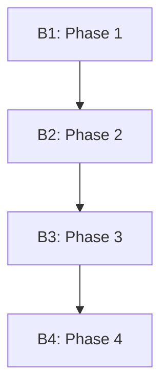

# Step-by-Step Plan to Implement SmartStack v5 Structure

## Overview
This document outlines the comprehensive implementation plan for transitioning from SmartStack v4 to SmartStack v5 (SS5), with a focus on establishing the Pattern Meta Catalog, Pattern Chain Synthesis, and related infrastructure. This plan reflects the architectural decisions documented in the SS5 ADRs and guides the multi-threaded refinement exercise to create a robust, pattern-based development framework that leverages the USS-to-B1-Series Method for structured implementation.

## Phase 1: Foundation Setup

### 1.1. Create Directory Structure for Documents
```bash
# Create foundation and training directories
mkdir -p /home/neo/SS4/kb/docs/ss5-foundation
mkdir -p /home/neo/SS4/kb/docs/ss5-train-new-thread

# Create ADR directory if it doesn't exist
mkdir -p /home/neo/SS4/kb/ADR
```

### 1.2. Create/Update Architectural Decision Records
```bash
# Update existing ADRs
cp -f /path/to/updated/ADR-0001-pattern-stewardship-framework.md /home/neo/SS4/kb/ADR/
cp -f /path/to/updated/ADR-0006-pattern-based-development.md /home/neo/SS4/kb/ADR/

# Create new ADRs
cp -f /path/to/new/ADR-0002-thread-training-system.md /home/neo/SS4/kb/ADR/
cp -f /path/to/new/ADR-0003-documentation-organization.md /home/neo/SS4/kb/ADR/
cp -f /path/to/new/ADR-0004-pattern-chain-synthesis.md /home/neo/SS4/kb/ADR/
cp -f /path/to/new/ADR-0005-pattern-meta-catalog.md /home/neo/SS4/kb/ADR/
cp -f /path/to/new/ADR-0007-pattern-chain-synthesis.md /home/neo/SS4/kb/docs/ss5-foundation/
cp -f /path/to/new/ADR-0008-thread-training-system.md /home/neo/SS4/kb/docs/ss5-foundation/
cp -f /path/to/new/ADR-0009-documentation-organization.md /home/neo/SS4/kb/docs/ss5-foundation/
cp -f /path/to/new/ADR-006-USS-to-B1-Series-Method.md /home/neo/SS4/kb/docs/adr/
```

### 1.3. Create Pattern Meta Catalog Infrastructure
```bash
# Create pattern category directories
mkdir -p /home/neo/SS4/ss5/patterns/authentication
mkdir -p /home/neo/SS4/ss5/patterns/ui
mkdir -p /home/neo/SS4/ss5/patterns/data
mkdir -p /home/neo/SS4/ss5/patterns/integration
mkdir -p /home/neo/SS4/ss5/patterns/process

# Create pattern chain directories
mkdir -p /home/neo/SS4/ss5/chains/_template
mkdir -p /home/neo/SS4/ss5/chains/p1.1
mkdir -p /home/neo/SS4/ss5/chains/hb

# Create scripts and bootstrap directories
mkdir -p /home/neo/SS4/ss5/scripts
mkdir -p /home/neo/SS4/bootstrap-scripts
```

### 1.4. Create Pattern Templates
```bash
# Copy and update pattern template
cp /home/neo/SS4/ss4/patterns/_template.md /home/neo/SS4/ss5/patterns/_template.md

# Create pattern chain template
cat > /home/neo/SS4/ss5/chains/_template.md << 'EOF'
# [Project Name] Pattern Chain: [Chain Name]

## Purpose
[Description of what this pattern chain accomplishes]

## User Stories
- US-XXX: [Story title]
- US-XXX: [Story title]

## Component Patterns
1. **[Pattern Name]**
   - Classification: [Authentication|UI|Data|Integration|Process]
   - Purpose: [How this pattern contributes to the chain]
   - Adaptations: [Project-specific adaptations]
   - Relationship: [How this pattern relates to others in the chain]
   - Interfaces: [Defined interaction points with other patterns]

2. **[Pattern Name]**
   - Classification: [Authentication|UI|Data|Integration|Process]
   - Purpose: [How this pattern contributes to the chain]
   - Adaptations: [Project-specific adaptations]
   - Relationship: [How this pattern relates to others in the chain]
   - Interfaces: [Defined interaction points with other patterns]

## Implementation Sequence
1. Step 1: [Implementation step with pattern reference]
2. Step 2: [Implementation step with pattern reference]
3. Step 3: [Implementation step with pattern reference]

## Verification Criteria
- [Criterion 1 with pattern reference]
- [Criterion 2 with pattern reference]
- [Criterion 3 with pattern reference]

## Chain Metrics
- Implementation efficiency: [Expected time savings]
- Quality improvement: [Expected defect reduction]
- Reusability: [Potential for reuse in other projects]

## Related Pattern Chains
- [Related Chain 1]: [Relationship description]
- [Related Chain 2]: [Relationship description]

## References
- [ADR reference]
- [Documentation reference]
EOF
```

### 1.5. Promote Foundation Documents
```bash
# Copy and rename foundation documents
cp /path/to/source/smartstack-v5-spec.md /home/neo/SS4/kb/docs/ss5-foundation/
cp /path/to/source/Architectural_Decision_SS5_Pattern_Stewardship.md /home/neo/SS4/kb/docs/ss5-foundation/
cp /path/to/source/ss5-implementation-plan.md /home/neo/SS4/kb/docs/ss5-foundation/
cp /path/to/source/ss5-b1-workflow-guide.md /home/neo/SS4/kb/docs/ss5-foundation/
cp /path/to/source/ss5-pattern-application-guidelines.md /home/neo/SS4/kb/docs/ss5-foundation/
cp /path/to/source/ss5-cursor-rules-roadmap.md /home/neo/SS4/kb/docs/ss5-foundation/
cp /path/to/source/USS-to-B1-transformation-guide.md /home/neo/SS4/kb/docs/ss5-foundation/

# Create foundation index
cp /path/to/source/foundation-README.md /home/neo/SS4/kb/docs/ss5-foundation/README.md
```

### 1.6. Promote Training Documents
```bash
# Copy and rename training documents
cp /path/to/source/SS4-P1.1-new-thread-training /home/neo/SS4/kb/docs/ss5-train-new-thread/ss5-thread-training
cp /path/to/source/CURSOR_AI_THREAD_MANAGEMENT.md /home/neo/SS4/kb/docs/ss5-train-new-thread/ss5-thread-management.md
cp /path/to/source/CURSOR_AI_OPTIMIZATION.md /home/neo/SS4/kb/docs/ss5-train-new-thread/ss5-optimization-guide.md

# Create training index
cp /path/to/source/training-README.md /home/neo/SS4/kb/docs/ss5-train-new-thread/README.md
```

## Phase 2: Pattern Migration and Documentation

### 2.1. Update Pattern Template with Meta Catalog Requirements
```bash
cat > /home/neo/SS4/ss5/patterns/_template.md << 'EOF'
# Pattern: [Pattern Name]

## Status
[Draft | Candidate | Validated | Core]

## Classification
[Authentication | UI | Data | Integration | Process]

## Problem Statement
[Detailed problem description]

## Solution
[Comprehensive solution description]

## Implementation
```[language]
// Code example
```

## Benefits
[Benefits of this pattern, with metrics where possible]

## Limitations
[Known limitations and constraints]

## Relationships
[How this pattern relates to other patterns]

## Pattern Interfaces
[Defined interaction points with other patterns]

## Usage Metrics
[Quantitative usage metrics]

## Evolution History
[Version history with changes]

## References
[ADR and documentation references]
EOF
```

### 2.2. Migrate Existing Validated Patterns
```bash
# Authentication patterns
cp /home/neo/SS4/ss4/patterns/authentication/hybrid-auth-flow.md /home/neo/SS4/ss5/patterns/authentication/

# UI patterns
cp /home/neo/SS4/ss4/patterns/ui/cursor-styled-login.md /home/neo/SS4/ss5/patterns/ui/

# Integration patterns
cp /home/neo/SS4/ss4/patterns/integration/build-resilient-components.md /home/neo/SS4/ss5/patterns/integration/
```

### 2.3. Document Core Patterns with Enhanced Meta Catalog Format

1. **CLI Command Registry Pattern** (`/home/neo/SS4/ss5/patterns/ui/cli-command-registry.md`)
   - Extract implementation details from codebase
   - Document with concrete examples
   - Add pattern interfaces and relationships
   - Include references to relevant ADRs

2. **Terminal UI Component System Pattern** (`/home/neo/SS4/ss5/patterns/ui/terminal-ui-component-system.md`)
   - Document the terminal components architecture
   - Include implementation examples
   - Define pattern interfaces
   - Link to pattern chain documentation

3. **SS5-B1 Workflow Pattern** (`/home/neo/SS4/ss5/patterns/process/ss5-b1-workflow.md`)
   - Document as THE DEFINING FOUNDATIONAL META-PATTERN
   - Include detailed workflow steps
   - Reference relevant ADRs
   - Include pattern chain synthesis guidance
   - Document integration with USS-to-B1-Series Method

4. **Terminal UI Component System Pattern** (`/home/neo/SS4/ss5/patterns/ui/terminal-ui-component-system.md`)
   - Document the terminal components architecture
   - Include implementation examples
   - Define pattern interfaces
   - Link to pattern chain documentation

5. **Responsive Terminal Display Pattern** (`/home/neo/SS4/ss5/patterns/ui/responsive-terminal-display.md`)
   - Document responsive design approach for terminal interfaces
   - Include screen size adaptations

6. **Environment Configuration Pattern** (`/home/neo/SS4/ss5/patterns/integration/environment-configuration.md`)
   - Document the hierarchical environment configuration approach
   - Include examples of URL handling across environments

### 2.4. Document New Core Patterns

1. **SS5-B1 Workflow Pattern** (`/home/neo/SS4/ss5/patterns/process/ss5-b1-workflow.md`)
   - Document as THE DEFINING FOUNDATIONAL META-PATTERN
   - Include detailed workflow steps
   - Reference existing B1-oriented training materials
   - Include USS-to-B1-Series Method implementation steps

2. **USS-to-B1 Transformation Pattern** (`/home/neo/SS4/ss5/patterns/process/uss-to-b1-transformation.md`)
   - Document the methodology for transforming User Story Suites into B1 branches
   - Include branch specification format
   - Document branch visualization techniques
   - Reference examples from USS-to-B1 transformation guide

### 2.5. Extract Patterns from ss4-patterns-reference.md
```bash
# Script to parse and extract patterns from reference document
python /home/neo/SS4/ss5/scripts/extract-patterns.py \
  --source "/home/neo/SS4/kb/docs/3.3retrain/ss4-patterns-reference.md" \
  --output "/home/neo/SS4/ss5/patterns/"
```

## Phase 3: Pattern Chain Creation

### 3.1. Create USS-to-B1 Pattern Chain Template
```bash
cat > /home/neo/SS4/ss5/chains/uss-b1/_template.md << 'EOF'
# USS-to-B1 Pattern Chain: [Project Name]

## User Story Suite Overview
[Description of the User Story Suite]

## Branch Sequence Plan
1. **B1: [Phase Description]**
   - User Stories: [US-XXX, US-XXX]
   - Core Capabilities: [List capabilities]
   - Patterns: [List applicable patterns]

2. **B2: [Phase Description]**
   - User Stories: [US-XXX, US-XXX]
   - Core Capabilities: [List capabilities]
   - Patterns: [List applicable patterns]

3. **B3: [Phase Description]**
   - User Stories: [US-XXX, US-XXX]
   - Core Capabilities: [List capabilities]
   - Patterns: [List applicable patterns]

## Branch Dependencies


## Implementation Approach
[Description of how the patterns will be implemented across branches]

## Verification Strategy
[Description of how each branch will be verified]

## Branch Progression Metrics
- Expected time per branch: [Time estimates]
- Complexity assessment: [Complexity metrics]
- Quality gates: [List of quality checks]

## References
- [ADR reference]
- [Documentation reference]
EOF
```

### 3.2. Create CLI Interface Pattern Chain
```bash
cat > /home/neo/SS4/ss5/chains/hb/cli-interface-chain.md << 'EOF'
# HealthBench Pattern Chain: CLI Interface

## Purpose
This pattern chain enables the creation of a command-line healthcare analytics platform with robust command handling, consistent UI, and responsive design.

## User Stories
- US-000: P1.1 Project Setup with CLI-Focused Next.js Template
- US-002: CLI Command Parser and Response Handler

## Component Patterns
1. **CLI Command Registry Pattern**
   - Classification: UI
   - Purpose: Provides centralized command registration, validation, and execution
   - Adaptations: Healthcare-specific commands and validation

2. **Terminal UI Component System Pattern**
   - Classification: UI
   - Purpose: Creates consistent terminal-style interface components
   - Adaptations: Themed for healthcare analytics display

3. **Responsive Terminal Display Pattern**
   - Classification: UI
   - Purpose: Ensures terminal interface works across device sizes
   - Adaptations: Optimized for data-rich healthcare reports

4. **Environment Configuration Pattern**
   - Classification: Integration
   - Purpose: Manages environment-specific configuration
   - Adaptations: Handles deployment-specific URLs and settings

## Implementation Sequence
1. Set up basic project structure with Next.js and Tailwind CSS
2. Implement Terminal UI Component System
3. Create Command Registry system
4. Implement basic commands (help, clear, etc.)
5. Add healthcare-specific commands (demo, insight)
6. Apply responsive design patterns
7. Configure environment-specific settings

## Verification Criteria
- Terminal UI renders correctly across device sizes
- Commands are properly registered and executed
- Error handling provides clear feedback
- Environment-specific configurations work correctly

## Related Pattern Chains
- Authentication Chain: Extends CLI with auth capabilities
EOF
```

### 3.3 Create Pattern Chain Synthesis Guide
```bash
cat > /home/neo/SS4/ss5/chains/_synthesis-guide.md << 'EOF'
# Pattern Chain Synthesis Guide

This guide outlines the process for synthesizing multiple patterns into coherent pattern chains for specific user stories.

## Synthesis Process
1. Analyze User Story requirements
2. Identify required capabilities
3. Select relevant patterns from meta catalog
4. Determine pattern adaptations
5. Define implementation sequence
6. Document verification criteria

## Selection Criteria
- Pattern relevance to story requirements
- Pattern qualification level (prefer Validated/Core)
- Pattern compatibility with other selected patterns
- Implementation complexity and time constraints

## Documentation Requirements
- Clear purpose statement
- List of user stories addressed
- Component patterns with classification and adaptations
- Step-by-step implementation sequence
- Verification criteria
- Related pattern chains

## Example Workflow
1. Read user story thoroughly
2. List required capabilities
3. Search pattern catalog for matching patterns
4. Create matrix of patterns and requirements
5. Select optimal pattern combination
6. Document using pattern chain template
EOF
```

## Phase 4: Bootstrap Script Migration and Enhancement

### 4.1. Migrate Bootstrap Scripts
```bash
# Copy existing bootstrap script
cp /home/neo/SS4/bootstrap-us000.sh /home/neo/SS4/bootstrap-scripts/bootstrap-us000.sh

# Create script for p1.1 project
cp /path/to/existing/p1.1/bootstrap.sh /home/neo/SS4/bootstrap-scripts/bootstrap-p1.1.sh || touch /home/neo/SS4/bootstrap-scripts/bootstrap-p1.1.sh
```

### 4.2. Create Bootstrap Script Generation Tool
```bash
cat > /home/neo/SS4/ss5/scripts/generate-bootstrap.sh << 'EOF'
#!/bin/bash
# Bootstrap Script Generator for SS5 Projects

PROJECT_NAME=$1
USS_PATH=$2
OUTPUT_PATH=$3

if [ -z "$PROJECT_NAME" ] || [ -z "$USS_PATH" ] || [ -z "$OUTPUT_PATH" ]; then
  echo "Usage: $0 project_name uss_path output_path"
  exit 1
fi

echo "Generating bootstrap script for $PROJECT_NAME..."
echo "Analyzing User Story Suite at $USS_PATH..."

# Template-based generation logic would go here
# This would analyze the USS and create appropriate bootstrap script

echo "Bootstrap script created at $OUTPUT_PATH"
EOF

chmod +x /home/neo/SS4/ss5/scripts/generate-bootstrap.sh
```

### 4.3. Document Bootstrap Script Pattern
```bash
cat > /home/neo/SS4/ss5/patterns/process/bootstrap-script.md << 'EOF'
# Pattern: Bootstrap Script Generation

## Status
Candidate

## Classification
Process

## Problem
Setting up new projects with consistent structure, dependencies, and patterns requires significant effort and is prone to inconsistencies.

## Context
This pattern should be applied when starting new projects that implement User Story Suites using SS5 patterns.

## Solution
Automated bootstrap scripts that:
1. Set up the directory structure
2. Install dependencies with correct versions
3. Configure development environment
4. Initialize pattern-based components
5. Configure deployment settings

## Implementation Example
```bash
#!/bin/bash
# Project bootstrap for USS-based implementation

# 1. Create directory structure
mkdir -p app/components app/lib app/public

# 2. Install dependencies
npm install next@15.2.3 react@18.2.0 react-dom@18.2.0
npm install -D typescript@5.4.3 tailwindcss@3.4.1

# 3. Initialize pattern-based components
# Component generation based on selected patterns
```

## Benefits
- Consistent project setup across implementations
- Reduced manual configuration errors
- Faster project initialization
- Pattern-based approach from project inception

## Related Patterns
- Pattern Chain Synthesis: Determines required patterns
- Environment Configuration: Sets up proper environments

## Usage Metrics
- Complexity: Medium
- Reusability: High
- Stories: All initial US-000 type stories

## Version History
| Version | Date | Description | Notes |
|---------|------|-------------|-------|
| 1.0 | 2023-04-15 | Initial pattern | Implementation for HealthBench |
EOF
```

## Phase 5: ADR and Documentation Updates

### 5.1. Create New ADR for Pattern-Based Development
```bash
cat > /home/neo/SS4/kb/ADR/ADR-0006-pattern-based-development.md << 'EOF'
# ADR-0006: Pattern-Based Development

## Status
Accepted

## Context
Traditional template-based approaches to project structure are inflexible and often require significant modification for specific use cases. We need an approach that offers both consistency and adaptability.

## Decision
We will adopt a pattern-based development approach where:
1. Reusable solutions are identified and documented as patterns
2. Patterns are classified and qualified through implementation
3. Project-specific pattern chains are synthesized for user stories
4. Implementation is guided by prompt chains derived from pattern chains

## Consequences
### Positive
- Increased adaptability to project-specific requirements
- Improved knowledge transfer between projects
- Progressive refinement of solutions across implementations
- Reduced redundancy and improved code quality

### Negative
- Requires additional documentation effort
- Pattern stewardship adds overhead to development process
- Learning curve for new developers to understand pattern catalog

## Implementation
1. Establish Pattern Meta Catalog with standardized documentation
2. Create pattern qualification process (Draft → Candidate → Validated → Core)
3. Implement pattern chain synthesis for user stories
4. Create prompt chains for AI-assisted implementation

## Related ADRs
- ADR-0001: Pattern Stewardship Framework

## References
- SmartStack v5 Specification
- HealthBench US-000 and US-001 implementations
EOF
```

### 5.2. Update SS5 Specification with Implementation Details
Add a new section to the SS5 specification document with implementation guidance.

### 5.3. Create Pattern Application Guidelines
```bash
cat > /home/neo/SS4/kb/docs/ss5-pattern-application-guidelines.md << 'EOF'
# SmartStack v5 Pattern Application Guidelines

This document provides practical guidance for applying SS5 patterns to implement User Story Suites.

## Pattern Selection Process
1. Read and understand the user story requirements
2. Identify required capabilities and technical components
3. Search the pattern catalog for relevant patterns
4. Evaluate pattern qualification status and applicability
5. Select patterns based on requirements coverage and compatibility

## Pattern Adaptation Process
1. Identify project-specific requirements not covered by patterns
2. Determine required adaptations to selected patterns
3. Document adaptations in pattern chain
4. Implement adaptations following pattern principles

## Pattern Chain Implementation
1. Follow implementation sequence defined in pattern chain
2. Use prompt chains for AI-assisted implementation
3. Document new patterns discovered during implementation
4. Provide feedback on pattern effectiveness

## Pattern Documentation Workflow
1. Identify potentially reusable solutions
2. Evaluate against pattern identification checklist
3. Document using standardized template
4. Submit for pattern qualification review
5. Update pattern catalog with new patterns

## Common Pitfalls
1. Over-engineering: Using complex patterns for simple problems
2. Under-documentation: Failing to document adaptations and new patterns
3. Pattern drift: Deviating from pattern principles during implementation
4. Isolation: Creating patterns that don't compose well with others

## Success Metrics
1. Implementation time reduction through pattern reuse
2. Code consistency across projects
3. Pattern qualification progression
4. Knowledge transfer effectiveness
EOF
```

## Phase 6: SS5-B1 Core Meta-Pattern Documentation

### 6.1. Document SS5-B1 Workflow Pattern
```bash
cat > /home/neo/SS4/ss5/patterns/process/ss5-b1-workflow.md << 'EOF'
# Pattern: SS5-B1 Workflow

## Status
Core Pattern ✅

## Classification
Process

## Problem
Inconsistent development workflows lead to context switching, deployment issues, and maintenance challenges, particularly in AI-assisted development.

## Context
This pattern is THE DEFINING FOUNDATIONAL META-PATTERN of SmartStack v5 and should be applied to all development work within the framework.

## Solution
A comprehensive development workflow that integrates branch-first principles with AI-assisted development and pattern-based implementation:

1. **Branch Creation**: Create dedicated feature/fix branches before any code changes
2. **Pattern Selection**: Identify and select applicable patterns from the catalog
3. **Pattern Chain Synthesis**: Combine patterns into effective implementation chains
4. **Implementation**: Follow prompt chains for guided, consistent implementation
5. **Documentation**: Document pattern usage, adaptations, and new patterns
6. **Verification**: Deploy changes to preview environments for testing
7. **Pull Request**: Submit changes with proper documentation

## Implementation Example
```bash
# 1. Create branch for specific user story
git checkout -b feat/US-001-github-oauth

# 2. Select patterns from catalog
# - Hybrid Auth Flow
# - Supabase GitHub OAuth Integration

# 3. Synthesize pattern chain
# - Create authentication-chain.md

# 4. Implement following prompt chain
# - Follow steps in healthbench-us001-prompt-chain.md

# 5. Document patterns and adaptations
# - Update pattern usage metrics
# - Document new patterns discovered

# 6. Verify in preview environment
vercel deploy

# 7. Create pull request
git push -u origin feat/US-001-github-oauth
# Create PR with detailed documentation
```

## Benefits
- Consistent development approach across projects
- Reduced context switching between tasks
- Clear documentation and knowledge transfer
- Improved code quality and maintainability
- Effective use of AI-assisted development

## Related Patterns
- Pattern Chain Synthesis: Combines patterns for specific stories
- Bootstrap Script Generation: Initializes project structure
- Pattern Documentation Workflow: Documents new patterns

## Usage Metrics
- Complexity: Medium (but decreases with familiarity)
- Reusability: High (core to all SS5 development)
- Stories: All user stories in SS5 projects

## Version History
| Version | Date | Description | Notes |
|---------|------|-------------|-------|
| 5.0 | 2023-04-15 | Formalized as Core Pattern | Evolved from SS4-B1 workflow |
| 4.0 | 2023-03-01 | Initial pattern | Original SS4-B1 workflow |
EOF
```

### 6.2. Extract and Document B1 Training Rules
```bash
# Extract B1 rules from .cursor.training
grep -A 3 "SS4-B1" /home/neo/SS4/kb/docs/3.3retrain/.cursor.rules > /home/neo/SS4/ss5/patterns/process/b1-rules.txt

# Create comprehensive documentation
cat > /home/neo/SS4/kb/docs/ss5-b1-workflow-guide.md << 'EOF'
# SmartStack v5 B1 Workflow Guide

This document provides a comprehensive guide to the SS5-B1 workflow, the defining foundational meta-pattern of SmartStack v5.

## Core Principles

1. **Branch First**: Always create branches before making changes
2. **Pattern Based**: Identify and apply patterns from the catalog
3. **Document Changes**: Use conventional commits and detailed PRs
4. **Verify Deployments**: Test changes in preview environments
5. **Maintain Context**: Preserve context across development threads

## Workflow Steps

### 1. Preparation
- Review the user story and acceptance criteria
- Identify required capabilities and technical components
- Search pattern catalog for relevant patterns
- Create pattern chain for the user story

### 2. Branch Creation
- Create branch with appropriate prefix (feat/, fix/, docs/, refactor/)
- Use descriptive branch name with user story ID
- Example: `feat/US-001-github-oauth`

### 3. Implementation
- Follow pattern chain implementation sequence
- Use AI-assisted development with prompt chains
- Document pattern adaptations and new patterns
- Create clear, focused commits with conventional format

### 4. Verification
- Deploy changes to preview environment
- Test against acceptance criteria
- Validate pattern effectiveness
- Document any issues or refinements needed

### 5. Documentation and Submission
- Ensure all changes are documented
- Update pattern usage metrics
- Create detailed pull request
- Reference implemented patterns and user stories

## Rules and Conventions

### Branch Naming
- Use prefixes to indicate change type:
  - `feat/`: New features
  - `fix/`: Bug fixes
  - `docs/`: Documentation updates
  - `refactor/`: Code refactoring
- Include user story ID in branch name
- Use kebab-case for descriptive portion

### Commit Messages
- Follow conventional commits format:
  - `feat: add GitHub OAuth integration [SS5-B1]`
  - `fix: resolve authentication redirect issue [SS5-B1]`
- Include SS5-B1 tag to indicate workflow adherence

### Pull Requests
- Provide detailed description of changes
- Reference implemented patterns
- Include screenshots or examples where appropriate
- List verification steps to validate functionality

## Success Metrics
- Consistent branch naming and commit messages
- Pattern usage documentation
- Successful preview deployments
- Clear pull request documentation

## References
- SS5-B1 Workflow Core Pattern
- Pattern Chain Synthesis Guide
- Pattern Application Guidelines
EOF
```

### 6.3. Create B1 Workflow Checklists
```bash
cat > /home/neo/SS4/ss5/scripts/b1-workflow-checklist.md << 'EOF'
# SS5-B1 Workflow Checklist

Use this checklist to ensure proper adherence to the SS5-B1 workflow for each user story.

## Pre-Implementation
- [ ] User story requirements reviewed and understood
- [ ] Required capabilities identified
- [ ] Relevant patterns selected from catalog
- [ ] Pattern chain created for user story
- [ ] Branch created with proper naming convention

## Implementation
- [ ] Following pattern chain implementation sequence
- [ ] Using prompt chains for AI-assisted development
- [ ] Creating clear, focused commits
- [ ] Following conventional commit format with SS5-B1 tag
- [ ] Documenting pattern adaptations

## Verification
- [ ] Changes deployed to preview environment
- [ ] Functionality tested against acceptance criteria
- [ ] Pattern effectiveness validated
- [ ] Issues and refinements documented

## Documentation and Submission
- [ ] Pattern usage metrics updated
- [ ] New patterns documented
- [ ] Pull request created with detailed description
- [ ] References to implemented patterns included
- [ ] Verification steps listed

## Pattern Stewardship
- [ ] Identified potentially reusable solutions
- [ ] Evaluated against pattern identification checklist
- [ ] Documented using standardized template
- [ ] Submitted for pattern qualification review
EOF
```

## Phase 7: React Snippet Integration

### 7.1. Document React Snippet Integration Pattern
```bash
cat > /home/neo/SS4/ss5/patterns/integration/react-snippet-integration.md << 'EOF'
# Pattern: React Snippet Integration

## Status
Candidate

## Classification
Integration

## Problem
Inconsistent React implementation patterns across components and projects lead to maintenance challenges, knowledge transfer issues, and reduced code quality.

## Context
This pattern should be applied when implementing React components within SS5 projects to ensure consistency, reduce boilerplate, and improve maintainability.

## Solution
Standardized code snippets based on the mature "ES7+ React/Redux/React-Native snippets v4.4.3" extension, which provides "Extensions for React, React-Native and Redux in JS/TS with ES7+ syntax. Customizable. Built-in integration with prettier."

### Key Adopted Snippets

#### Functional Component Creation
- `rafce` → React Arrow Function Component with Export
```jsx
import React from 'react'

const ComponentName = () => {
  return <div>ComponentName</div>
}

export default ComponentName
```

#### Hook Usage
- `useS` → useState Hook
```jsx
const [state, setState] = useState(initialState)
```

- `useE` → useEffect Hook
```jsx
useEffect(() => {
  // Effect logic
  return () => {
    // Cleanup logic
  }
}, [dependencies])
```

#### TypeScript Components
- `tsrafce` → TypeScript React Arrow Function Component with Export
```tsx
import React from 'react'

interface Props {}

const ComponentName = ({}: Props) => {
  return <div>ComponentName</div>
}

export default ComponentName
```

#### Testing Patterns
- `test` → Jest Test Case
```jsx
test('should ', () => {
  // Test logic
})
```

## Benefits
- Consistent component creation across SS5 projects
- Reduced boilerplate code
- Standard hook usage patterns
- Prettier integration for code formatting
- TypeScript-first approach

## Related Patterns
- Terminal UI Component System: Uses consistent component creation
- Environment Configuration: Provides environment-aware components

## Usage Metrics
- Complexity: Low
- Reusability: High
- Stories: All stories with React components

## Version History
| Version | Date | Description | Notes |
|---------|------|-------------|-------|
| 1.0 | 2023-04-15 | Initial pattern | Documentation of established snippets |
EOF
```

### 7.2. Create Snippet Integration Script
```bash
cat > /home/neo/SS4/ss5/scripts/snippet-integration.sh << 'EOF'
#!/bin/bash
# Script to integrate React snippets into VSCode

VSCODE_SNIPPETS_DIR="$HOME/.config/Code/User/snippets"
REACT_SNIPPETS_FILE="$VSCODE_SNIPPETS_DIR/reactsnippets.code-snippets"

mkdir -p "$VSCODE_SNIPPETS_DIR"

cat > "$REACT_SNIPPETS_FILE" << 'SNIPPETS'
{
  "React Arrow Function Component with Export": {
    "prefix": "rafce",
    "body": [
      "import React from 'react'",
      "",
      "const ${1:${TM_FILENAME_BASE}} = () => {",
      "  return <div>${1:${TM_FILENAME_BASE}}</div>",
      "}",
      "",
      "export default ${1:${TM_FILENAME_BASE}}"
    ],
    "description": "React Arrow Function Component with Export"
  },
  "useState Hook": {
    "prefix": "useS",
    "body": [
      "const [${1:state}, set${1/(.*)/${1:/capitalize}/}] = useState(${2:initialState})"
    ],
    "description": "useState Hook"
  },
  "useEffect Hook": {
    "prefix": "useE",
    "body": [
      "useEffect(() => {",
      "  ${1:// Effect logic}",
      "  return () => {",
      "    ${2:// Cleanup logic}",
      "  }",
      "}, [${3:dependencies}])"
    ],
    "description": "useEffect Hook"
  },
  "TypeScript React Arrow Function Component with Export": {
    "prefix": "tsrafce",
    "body": [
      "import React from 'react'",
      "",
      "interface Props {",
      "  ${2:// Props interface}",
      "}",
      "",
      "const ${1:${TM_FILENAME_BASE}} = ({${3:props}}: Props) => {",
      "  return <div>${1:${TM_FILENAME_BASE}}</div>",
      "}",
      "",
      "export default ${1:${TM_FILENAME_BASE}}"
    ],
    "description": "TypeScript React Arrow Function Component with Export"
  },
  "Jest Test Case": {
    "prefix": "test",
    "body": [
      "test('${1:should }', () => {",
      "  ${2:// Test logic}",
      "})"
    ],
    "description": "Jest Test Case"
  }
}
SNIPPETS

echo "React snippets installed at $REACT_SNIPPETS_FILE"
EOF

chmod +x /home/neo/SS4/ss5/scripts/snippet-integration.sh
```

## Phase 8: AI Workflow Integration

### 8.1. Create Pattern-Specific Prompt Templates
```bash
mkdir -p /home/neo/SS4/ss5/prompts

cat > /home/neo/SS4/ss5/prompts/pattern-identification.md << 'EOF'
# Pattern Identification Prompt

I've implemented a solution that could be a reusable pattern. Please help me document it following the SS5 Pattern Stewardship Framework:

**Pattern Category**: [authentication|ui|data|integration|process]

**Pattern Name**: [descriptive-name]

**Problem Solved**: [describe the problem this pattern solves]

**Implementation**: [share the core implementation code]

Please use the pattern template to create a comprehensive pattern document that includes:
1. Problem statement and context
2. Solution details with code examples
3. Benefits and limitations
4. Related patterns
5. Usage metrics

When done, summarize with "SS5-B1 Pattern Documented: [pattern name] | Status: Draft"
EOF

cat > /home/neo/SS4/ss5/prompts/pattern-implementation.md << 'EOF'
# Pattern Implementation Prompt

I'm implementing [User Story ID] following the SS5-B1 workflow. Based on the pattern chain, I need to apply the following patterns:

1. [Pattern Name 1]
2. [Pattern Name 2]
3. [Pattern Name 3]

Please provide step-by-step guidance for implementing these patterns according to the SS5-B1 workflow:

1. Show the git commands for creating the appropriate branch
2. Provide implementation code for each pattern
3. Show how the patterns integrate with each other
4. Include verification steps to ensure correct implementation
5. Show commit message examples following conventional format with SS5-B1 tag

For each step, explain how it implements the relevant pattern and maintains SS5-B1 workflow compatibility.

When finished, use the format: "SS5-B1 Implementation Guide: [SUMMARY] | Next Step: [RECOMMENDATION]"
EOF

cat > /home/neo/SS4/ss5/prompts/pattern-chain-synthesis.md << 'EOF'
# Pattern Chain Synthesis Prompt

I'm working on [User Story ID]: [Story Title] and need help synthesizing a pattern chain following the SS5-B1 workflow.

The user story requires the following capabilities:
1. [Capability 1]
2. [Capability 2]
3. [Capability 3]

Based on the SS5 Pattern Meta Catalog, please:

1. Identify relevant patterns for each capability
2. Synthesize these patterns into a cohesive pattern chain
3. Define the implementation sequence
4. Provide verification criteria

Please follow the pattern chain template and provide a complete pattern chain document.

When complete, summarize with "SS5-B1 Pattern Chain: [SUMMARY] | Implementation: [FIRST STEP]"
EOF
```

### 8.2. Create SS5-B1 Specific Prompts
```bash
cat > /home/neo/SS4/ss5/prompts/b1-workflow-guide.md << 'EOF'
# SS5-B1 Workflow Guide Prompt

I'm working on a project following the SmartStack v5 (SS5) Branch First (B1) workflow. Please help me implement the following change:

[DESCRIBE THE FEATURE/FIX NEEDED]

Please follow the complete SS5-B1 workflow:

1. Create a branch with appropriate prefix (feat/, fix/, docs/, refactor/)
2. Identify and select applicable patterns from the SS5 Pattern Meta Catalog
3. Synthesize a pattern chain for this specific implementation
4. Implement focused changes only addressing the specific issue
5. Create clear commit(s) with conventional commit messages
6. Push the branch and create a Pull Request
7. Generate a preview deployment for testing
8. Document any new patterns discovered during implementation

For each step, please show the exact commands you would run and explain what you're doing.

When finished, use the format: "SS5-B1 Workflow Complete: [SUMMARY] | Preview: [URL]"
EOF
```

### 8.3. Create Pattern Verification Prompt
```bash
cat > /home/neo/SS4/ss5/prompts/pattern-verification.md << 'EOF'
# Pattern Verification Prompt

I've implemented [User Story ID] following the SS5-B1 workflow using the following pattern chain:

[PATTERN CHAIN DETAILS]

Please help me verify the implementation:

1. Review the implementation against pattern requirements
2. Verify adherence to SS5-B1 workflow
3. Check for potential improvements or optimizations
4. Identify any new patterns that emerged during implementation
5. Provide feedback on pattern effectiveness and adaptations

For any issues found, please provide specific recommendations for addressing them.

When finished, use the format: "SS5-B1 Verification Complete: [SUMMARY] | Recommendations: [KEY POINTS]"
EOF
```

## Phase 9: Verification and Documentation

### 9.1. Create SS5 Verification Checklist
```bash
cat > /home/neo/SS4/ss5/scripts/ss5-verification-checklist.md << 'EOF'
# SmartStack v5 Implementation Verification Checklist

Use this checklist to verify that the SS5 implementation meets all requirements:

## Directory Structure
- [ ] SS5 infrastructure directories created
- [ ] Pattern category directories established
- [ ] Pattern chain directories established
- [ ] Script and bootstrap directories created

## Pattern Documentation
- [ ] Pattern templates created
- [ ] Existing validated patterns migrated
- [ ] Core HealthBench patterns documented
- [ ] SS5-B1 Workflow pattern documented
- [ ] React Snippet Integration pattern documented

## Pattern Chains
- [ ] Pattern chain template created
- [ ] CLI Interface pattern chain documented
- [ ] Authentication pattern chain documented
- [ ] Pattern chain synthesis guide created

## Bootstrap Scripts
- [ ] Bootstrap scripts migrated
- [ ] Bootstrap script generation tool created
- [ ] Bootstrap script pattern documented

## Documentation
- [ ] ADR for Pattern-Based Development created
- [ ] SS5 specification updated
- [ ] Pattern application guidelines created
- [ ] SS5-B1 workflow guide created
- [ ] B1 workflow checklists created

## AI Integration
- [ ] Pattern-specific prompt templates created
- [ ] SS5-B1 specific prompts created
- [ ] Pattern verification prompt created

## Final Verification
- [ ] All documentation is accessible and clear
- [ ] Directory structure matches specification
- [ ] Scripts are executable
- [ ] Patterns are properly classified and documented
EOF
```

### 9.2. Create Implementation Guide
```bash
cat > /home/neo/SS4/kb/docs/ss5-implementation-guide.md << 'EOF'
# SmartStack v5 Implementation Guide

This guide provides practical instructions for implementing the SmartStack v5 framework in new and existing projects.

## New Project Implementation

### 1. User Story Suite Analysis
- Review the User Story Suite document
- Identify required capabilities and technical components
- Determine implementation sequence based on dependencies
- Map capabilities to potential pattern applications

### 2. Pattern Chain Synthesis
- For each user story, select relevant patterns from the catalog
- Synthesize patterns into cohesive pattern chains
- Document implementation sequence and verification criteria
- Create prompt chains for AI-assisted implementation

### 3. Project Bootstrapping
- Use bootstrap script generation tool to create project-specific script
- Execute bootstrap script to set up initial project structure
- Configure development environment and tools
- Initialize core patterns and components

### 4. Story Implementation
- Follow the SS5-B1 workflow for each user story
- Use prompt chains to guide implementation
- Document pattern adaptations and new patterns
- Verify implementation against pattern chain criteria

### 5. Pattern Feedback
- Evaluate pattern effectiveness in implementation
- Document adaptations and challenges encountered
- Propose refinements to existing patterns
- Submit new patterns for qualification

## Existing Project Migration

### 1. Project Assessment
- Review existing project structure and code
- Identify patterns already in use (explicit or implicit)
- Determine gaps and opportunities for pattern application
- Create migration plan with prioritized changes

### 2. Incremental Pattern Application
- Start with core infrastructure patterns
- Apply patterns incrementally with each new feature
- Refactor existing code to align with patterns when touched
- Document pattern usage and adaptations

### 3. Workflow Integration
- Adopt SS5-B1 workflow for all new development
- Integrate pattern-based approach into development process
- Use pattern chains for feature planning
- Apply AI-assisted development with prompt chains

## Key Success Factors
1. Consistent pattern documentation
2. Regular pattern review and qualification
3. Feedback loop from implementation to pattern refinement
4. Knowledge sharing across team members
5. AI assistance leveraging pattern knowledge
EOF
```

### 9.3. Final Project Structure Documentation
```bash
cat > /home/neo/SS4/kb/docs/ss5-structure.md << 'EOF'
# SmartStack v5 Structure Documentation

This document provides a detailed reference for the SmartStack v5 directory structure and file organization.

## Root Directory Structure
```
SS4/                           # Root directory
├── [project]/                 # Project-specific directories
│   ├── app/                   # Next.js application
│   ├── components/            # UI components
│   ├── lib/                   # Utility libraries
│   ├── docs/                  # Project documentation
│   └── public/                # Static assets
├── kb/                        # Knowledge base
│   ├── docs/                  # Documentation
│   │   ├── 3.3retrain/        # Project-specific documentation
│   │   ├── smartstack-v5-spec.md
│   │   ├── ss5-implementation-plan.md
│   │   ├── ss5-implementation-guide.md
│   │   ├── ss5-structure.md
│   │   └── ss5-pattern-application-guidelines.md
│   └── ADR/                   # Architectural decisions
│       ├── ADR-0001-pattern-stewardship-framework.md
│       └── ADR-0006-pattern-based-development.md
├── ss5/                       # SmartStack v5 infrastructure
│   ├── patterns/              # Pattern catalog
│   │   ├── authentication/    # Auth-related patterns
│   │   ├── ui/                # UI patterns
│   │   ├── data/              # Data patterns
│   │   ├── integration/       # Integration patterns
│   │   ├── process/           # Process patterns
│   │   └── _template.md       # Pattern documentation template
│   ├── chains/                # Pattern chains
│   │   ├── _template.md       # Chain documentation template
│   │   ├── _synthesis-guide.md # Chain synthesis guidance
│   │   ├── p1.1/              # P1.1 pattern chains
│   │   └── hb/                # HealthBench pattern chains
│   ├── prompts/               # AI prompt templates
│   │   ├── pattern-identification.md
│   │   ├── pattern-implementation.md
│   │   ├── pattern-chain-synthesis.md
│   │   ├── b1-workflow-guide.md
│   │   └── pattern-verification.md
│   └── scripts/               # Utility scripts
│       ├── generate-bootstrap.sh
│       ├── snippet-integration.sh
│       ├── b1-workflow-checklist.md
│       └── ss5-verification-checklist.md
└── bootstrap-scripts/         # Project bootstrap scripts
    ├── bootstrap-p1.1.sh      # P1.1 bootstrap script
    └── bootstrap-us000.sh     # HealthBench bootstrap script
```

## File Purposes

### Knowledge Base (kb/)
- **docs/**: Documentation for SS5 framework and projects
- **ADR/**: Architectural Decision Records defining key decisions

### SmartStack v5 Infrastructure (ss5/)
- **patterns/**: Pattern catalog organized by category
- **chains/**: Pattern chains for specific projects
- **prompts/**: AI prompt templates for pattern-based development
- **scripts/**: Utility scripts for SS5 processes

### Bootstrap Scripts (bootstrap-scripts/)
- Project-specific bootstrap scripts for initial setup

## Key Files
- **smartstack-v5-spec.md**: Core specification document
- **ss5-implementation-plan.md**: Step-by-step implementation plan
- **ss5-b1-workflow-guide.md**: Comprehensive guide to SS5-B1 workflow
- **_template.md**: Template files for patterns and chains
- **ADR-0006-pattern-based-development.md**: ADR for pattern approach

## Maintenance Guidelines
1. Keep pattern documentation up-to-date
2. Regularly review and qualify patterns
3. Document new patterns as they emerge
4. Update bootstrap scripts with pattern changes
5. Maintain AI prompt templates to reflect current best practices
EOF
```

## Phase 10: AI-Pattern Collaboration Model Implementation

### 10.1. Update Pattern Qualification Process
```bash
# Create updated documentation for the qualification process
cat > /home/neo/SS4/kb/docs/3.3/SS5_Pattern_Qualification_Process.md << 'EOF'
# SS5 Pattern Qualification Process

This document describes the enhanced qualification process for patterns in the SS5 framework, now including the Adaptive status level and guidance for CAI-A collaboration.

## Pattern Status Levels

1. **Draft**
   - Initial implementation in at least 1 context
   - Basic documentation with minimal structure
   - **CAI-A Guidance**: Consider as inspiration only; proactively develop better solutions

2. **Candidate**
   - Used in at least 2 contexts
   - More complete documentation with examples
   - **CAI-A Guidance**: Consider as a starting point but freely adapt; suggest improvements

3. **Validated**
   - Proven in 3+ contexts
   - Comprehensive documentation
   - **CAI-A Guidance**: Use as default approach but adapt to context; document adaptations

4. **Adaptive**
   - Proven pattern with recognized variation points
   - Documentation includes Core Elements and Adaptation Points
   - **CAI-A Guidance**: Follow the pattern's core principles but actively optimize implementation details

5. **Core**
   - Essential foundational pattern (e.g., SS5-B1 Workflow)
   - Extensive documentation and examples
   - **CAI-A Guidance**: Must adhere closely; modifications limited to non-architectural aspects

## Qualification Process

The qualification of a pattern progresses through these stages:

1. **Pattern Identification**
   - Pattern emerges during implementation
   - CAI-A or developer identifies potential pattern
   - Basic documentation created in Draft status

2. **Pattern Candidate Review**
   - Pattern used in a second context
   - CAI-A documents adaptations made
   - Pattern Steward reviews for promotion to Candidate

3. **Pattern Validation**
   - Pattern used in 3+ contexts
   - CAI-A provides implementation insights
   - Pattern Steward reviews for promotion to Validated

4. **Adaptation Assessment**
   - Pattern evaluated for adaptation points
   - CAI-A identifies areas for optimization
   - Pattern Steward designates Adaptive status with clear adaptation boundaries

5. **Core Pattern Designation**
   - Reserved for essential architectural patterns
   - Requires extensive testing and usage
   - Pattern Steward designates Core status with strict adherence requirements
EOF
```

### 10.2. Update Pattern Documentation Templates
1. Add AI Collaboration sections to pattern template
2. Add YAML frontmatter to pattern and chain templates
3. Update existing documentation to include AI collaboration guidance

### 10.3. Create AI Prompting Framework
```bash
# Create AI prompting framework documentation
cat > /home/neo/SS4/kb/docs/3.3/SS5_AI_Prompting_Framework.md << 'EOF'
# SS5 AI Prompting Framework

This document provides guidance for effective prompting of CursorAI-Agent (CAI-A) when implementing patterns in the SS5 framework.

## Baseline Prompt Template for Pattern Application

```
I need to implement [description of feature or component].

Potentially relevant SS5 patterns:
- [Pattern 1] (Status: [Core/Adaptive/Validated/Candidate/Draft])
- [Pattern 2] (Status: [Core/Adaptive/Validated/Candidate/Draft])

For Core patterns (currently SS5-B1), please adhere closely to the established approach.
For other patterns, you're empowered to adapt or create new solutions as needed.
Please document any adaptations or improvements you make to patterns.
```

## Pattern Selection Prompts

```
Based on the user story [story description], please identify relevant patterns from the SS5 Pattern Meta Catalog.

For each pattern, please indicate:
1. Pattern name and status
2. Relevance to the user story
3. Potential adaptations needed
4. Implementation considerations
```

## Pattern Chain Synthesis Prompts

```
Using the following patterns:
- [Pattern 1] (Status: [Core/Adaptive/Validated/Candidate/Draft])
- [Pattern 2] (Status: [Core/Adaptive/Validated/Candidate/Draft])

Please create a pattern chain for implementing [user story description].

Include:
1. Component patterns with adaptation guidance
2. Implementation sequence
3. Verification criteria
```

## Implementation Prompts

```
I need to implement [component/feature] following the [Pattern Chain Name].

The chain includes the following patterns:
- [Pattern 1] (Status: [Core/Adaptive/Validated/Candidate/Draft], Adherence: [Strict/Principles/Flexible])
- [Pattern 2] (Status: [Core/Adaptive/Validated/Candidate/Draft], Adherence: [Strict/Principles/Flexible])

Please lead the implementation with appropriate pattern application and document any adaptations.
```

## Pattern Documentation Prompts

```
Based on the implementation of [component/feature], please document:

1. Any adaptations made to existing patterns
2. Any new patterns that emerged during implementation
3. Updates needed to pattern documentation
4. Pattern metrics and insights
```

## Best Practices

1. Always include pattern status information in prompts
2. Clearly indicate where adaptation is encouraged vs. where strict adherence is required
3. Ask CAI-A to document adaptations and improvements
4. Prompt for implementation insights that could lead to pattern evolution
5. Review CAI-A's pattern applications and provide feedback for improvement
EOF
```

### 10.4. Update SS5-B1 Workflow with Collaborative Model
1. Revise workflow steps to include CAI-A and Pattern Steward responsibilities
2. Document collaborative approach for each workflow step
3. Update verification process to include pattern status considerations

### 10.5. Implement Pattern Metrics for AI Adaptations
1. Enhance pattern metrics to track AI adaptations
2. Create metrics for adaptation value
3. Implement dashboard showing pattern evolution through AI collaboration

### 10.6. Create Collaborative Stewardship Best Practices
```bash
# Document best practices for the collaborative stewardship model
cat > /home/neo/SS4/kb/docs/3.3/SS5_Collaborative_Stewardship_Best_Practices.md << 'EOF'
# SS5 Collaborative Stewardship Best Practices

This document outlines best practices for the collaborative Pattern Stewardship model between CursorAI-Agent (CAI-A) and human Pattern Stewards.

## Roles and Responsibilities

### CAI-A Responsibilities
- Proactively lead pattern application and adaptation
- Document adaptations and pattern evolution suggestions
- Maintain pattern documentation and consistency
- Identify pattern gaps and propose new patterns
- Generate implementation solutions when patterns are insufficient

### Pattern Steward Responsibilities
- Provide architectural vision and oversight
- Review and approve pattern status changes
- Evaluate CAI-A adaptations for architectural alignment
- Make final decisions on pattern evolution
- Guide overall pattern ecosystem development

## Collaboration Best Practices

1. **Pattern Status Clarity**
   - Use pattern status to clearly signal where AI adaptation is encouraged
   - Document both core elements and adaptation points in pattern documentation
   - Review pattern status regularly based on implementation experience

2. **Documentation Practices**
   - Include YAML summaries in all pattern documentation
   - Document CAI-A observations and adaptation history
   - Maintain clear indication of pattern status and adherence requirements

3. **Implementation Collaboration**
   - CAI-A leads implementation with Pattern Steward guidance
   - Document all significant adaptations for pattern evolution
   - Use metrics to evaluate adaptation effectiveness

4. **Pattern Evolution Process**
   - Regularly review CAI-A adaptations for pattern improvements
   - Promote patterns based on usage metrics and adaptation value
   - Document successful adaptations as pattern improvements

5. **Knowledge Sharing**
   - Capture CAI-A insights about patterns and implementation
   - Share implementation learnings between projects
   - Use pattern metrics to guide improvements

## Measurement and Improvement

Regularly assess the effectiveness of the collaborative model using:

1. **Pattern Evolution Metrics**
   - Number of patterns progressing through qualification levels
   - Number of valuable adaptations incorporated into patterns
   - Reduction in implementation time through pattern reuse

2. **Implementation Efficiency**
   - Time to implement user stories using the collaborative model
   - Code quality and defect rates in pattern-based implementations
   - Developer satisfaction with pattern guidance

3. **Documentation Quality**
   - Completeness of pattern documentation
   - Clarity of adaptation guidance
   - Usefulness of implementation examples

## Continuous Improvement Cycle

1. Implement patterns collaboratively
2. Document adaptations and insights
3. Measure implementation effectiveness
4. Update patterns based on learnings
5. Adjust collaboration model as needed
EOF
```

## Note to New CursorAI-Agent Thread

You have successfully analyzed key SS5 documents and now have a good understanding of:
1. The SmartStack v5 (SS5) implementation plan and pattern-based approach
2. The system of Pattern Meta Catalog and project-specific pattern chains
3. The Pattern Qualification Process from Draft to Core
4. The SS5-B1 Workflow that serves as the core process pattern
5. The Bootstrap Script system for project initialization
6. React Snippet integration as a concrete example of pattern implementation
7. The Automated Documentation Generation for maintaining pattern documentation
8. The Pattern Metrics & Analytics system for data-driven stewardship decisions
9. The new AI-Pattern Collaborative Stewardship Framework that balances pattern adherence with AI innovation

This plan is now progressing to completion:

- ✅ Phase 1: Initial Directory Structure Setup
- ✅ Phase 2: Pattern Migration and Documentation
- ✅ Phase 3: Pattern Chain Creation
- ✅ Phase 4: Bootstrap Script Migration and Enhancement
- ✅ Phase 5: ADR and Documentation Updates
- ✅ Phase 6: SS5-B1 Workflow Implementation
- ✅ Phase 7: React Snippet Integration
- ✅ Phase 8: Automated Documentation Generation
- ✅ Phase 9: Pattern Metrics & Analytics
- ⬜ Phase 10: AI-Pattern Collaboration Model Implementation

For additional context, please review these key files:
1. `/home/neo/SS4/kb/docs/3.3/SS5_Pattern_AI_Collaboration_Roadmap.md` - The foundational architectural decision document
2. `/home/neo/SS4/kb/docs/3.3/Architectural_Decision_SS5_Pattern_Stewardship.md` - Detailed pattern stewardship framework
3. `/home/neo/SS4/ss5/patterns/process/ss5-b1-workflow.md` - The core workflow pattern documentation
4. `/home/neo/SS4/ss5/patterns/_template.md` - The updated pattern template with AI collaboration sections
5. `/home/neo/SS4/ss5/chains/_template.md` - The updated chain template with adherence levels

This comprehensive set of documentation will provide the new thread with full context on the completed work and the foundational knowledge required to implement the remaining phases of the SmartStack v5 structure. 