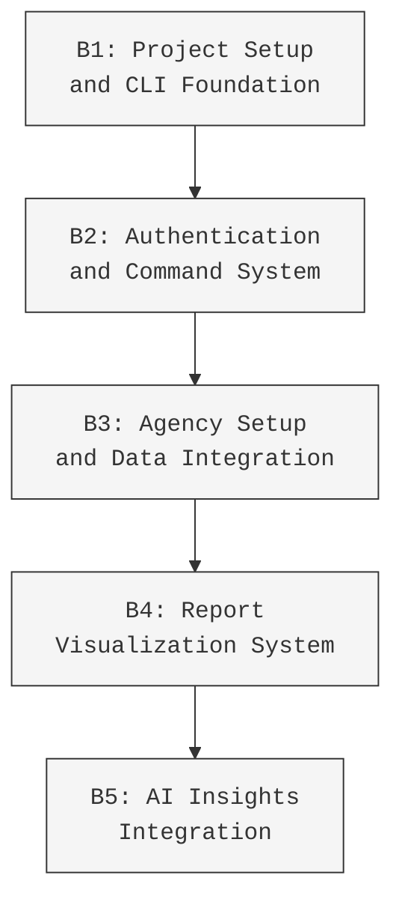

<!-- SS5-PRIORITY: 7 -->
<!-- SS5-CONTEXT-ORDER: Required document for SS5 thread training -->
# HealthBench: CLI-Driven Healthcare Analytics Suite (v4)

## System Overview

HealthBench is a command-line-driven healthcare analytics platform designed to provide home health agencies with powerful quality metrics, benchmarking capabilities, and AI-powered insights. The system focuses on delivering maximum analytical value through a text-based CLI interface that mimics the look and feel of Cursor AI, prioritizing immediate actionability over complex visualizations.

## MVP Core Philosophy

The HealthBench MVP embraces the following key principles:

1. **CLI-First Interface**: Command-line interface that prioritizes efficient information access and AI interactions
2. **Text-Only Analytics**: Powerful data analysis through formatted text reports without requiring complex visualizations
3. **AI-Powered Insights**: Seamless integration with Perplexity API to provide contextual analysis and recommendations
4. **No-Visualization Roadmap**: Focus on rich text formatting and ASCII/Unicode visualization techniques
5. **Focused Report Suite**: Initial launch with 3 high-impact reports (Star Rating Decomposition, Performance Trend, Executive Summary) with phased expansion plan
6. **Minimal Data Entry**: Automated data import from free CMS APIs with minimal user input required
7. **Premium Insights Model**: Tiered access to AI-powered analysis with progressively valuable insights
8. **Low-Complexity Implementation**: Simplified technical approach for rapid time-to-market
9. **Differentiated Experience**: Unique CLI interface that stands out from dashboard-focused competitors

## User Experience Design

```
┌─────────────────────────────────────── HealthBench ────────────────────────────────────────┐
│                                                                                            │
│ [REPORT CONTENT AREA]                                                                      │
│                                                                                            │
│ ┌────────────────────────────────── AI INSIGHT PANEL ──────────────────────────────────┐   │
│ │                                                                                      │   │
│ │ [DYNAMIC AI RESPONSE BASED ON STANDARD OR CUSTOM PROMPT]                            │   │
│ │                                                                                      │   │
│ └──────────────────────────────────────────────────────────────────────────────────────┘   │
│                                                                                            │
│ ┌──── SUGGESTED PROMPTS (PREMIUM) ────┐                                                    │
│ │ >1 How does this compare to peers?  │                                                    │
│ │ >2 What implementation steps work?  │                                                    │
│ │ >3 What's the ROI for improvement?  │                                                    │
│ └────────────────────────────────────┘                                                     │
│                                                                                            │
│ > _                                                                                        │
└────────────────────────────────────────────────────────────────────────────────────────────┘
```

## Core Command Structure

The CLI interface uses a simple, intuitive command structure:

1. **Navigation Commands:**
   - `>view [report-id]` - Display a specific report
   - `>list reports` - Show available reports
   - `>help` - Show available commands

2. **Insight Commands:**
   - `>insight` - Generate standard insight for current report
   - `>1`, `>2`, `>3` - Execute suggested premium prompts
   - Any other text - Treated as custom prompt about current report

## User Stories Suite

```yaml
story:
  id: "US-000"
  title: "P1.1 Project Setup with CLI-Focused Next.js Template"
  type: "infrastructure"
  priority: "P0"
  complexity: "S"
  dependencies: []
  complexity_metrics:
    acceptance_criteria: 4
    integration_points: "Low"
    state_transitions: "Simple"
    data_dependencies: "Isolated"
  technical_context:
    architecture: "Next.js App Router"
    stack: ["Next.js 15.2.3", "TypeScript 5.4.3", "Tailwind CSS 3.4.1", "react-terminal-ui"]
    constraints: ["Vercel Deployment", "Terminal UI Focus"]
  acceptance_criteria:
    functional:
      - "As a solopreneur, I can deploy a clean Next.js template with terminal UI components"
      - "As a solopreneur, I can create a CLI-style interface mimicking Cursor AI"
      - "As a solopreneur, I can build a basic command parser for CLI interactions"
      - "As a solopreneur, I can implement a clean layout matching the design mockup"
  implementation_notes:
    timeline: "3 days for initial setup"
```

```yaml
story:
  id: "US-001"
  title: "GitHub OAuth Authentication with CLI Interface"
  type: "feature"
  priority: "P0"
  complexity: "M"
  dependencies: ["US-000"]
  complexity_metrics:
    acceptance_criteria: 4
    integration_points: "Medium"
    state_transitions: "Simple"
    data_dependencies: "Isolated"
  technical_context:
    architecture: "Client-Server with SSR fallbacks"
    stack: ["Next.js", "Supabase Auth", "react-terminal-ui", "TypeScript"]
    constraints: ["Terminal UI Focus", "Progressive Enhancement"]
  acceptance_criteria:
    functional:
      - "As a user, I can log in with GitHub using a CLI-style command"
      - "As a user, I receive terminal-style feedback during authentication"
      - "As a user, I am redirected to the CLI interface after authentication"
      - "As a user, I can see appropriate error messages if authentication fails"
  implementation_notes:
    architecture: "Implement auth with createClientComponentClient for reliability"
    ui_components: "Use react-terminal-ui for terminal styling and Tailwind for layout"
```

```yaml
story:
  id: "US-002"
  title: "CLI Command Parser and Response Handler"
  type: "feature"
  priority: "P0"
  complexity: "M"
  dependencies: ["US-001"]
  complexity_metrics:
    acceptance_criteria: 4
    integration_points: "Low"
    state_transitions: "Simple"
    data_dependencies: "Isolated"
  technical_context:
    architecture: "Client-side command processor"
    stack: ["Next.js", "TypeScript", "react-terminal-ui"]
    constraints: ["Command Pattern", "Performance"]
  acceptance_criteria:
    functional:
      - "As a user, I can type commands in a familiar CLI style interface"
      - "As a user, I receive appropriate responses to valid commands"
      - "As a user, I see helpful error messages for invalid commands"
      - "As a user, I can navigate through command history using up/down arrows"
  implementation_notes:
    architecture: "Implement command pattern for extensible command handling"
    ui_components: "Use react-terminal-ui with custom styling to match design"
    command_registry_pattern: |
      Implement a "CLI Command Registry" pattern for extensible command handling:
      
      ```typescript
      // Command interface
      interface Command {
        name: string;
        description: string;
        usage: string;
        execute(args: string[]): Promise<CommandResult>;
        validate(args: string[]): boolean;
      }
      
      // Command registry
      class CommandRegistry {
        private commands: Map<string, Command> = new Map();
        
        register(command: Command): void {
          this.commands.set(command.name, command);
        }
        
        get(commandName: string): Command | undefined {
          return this.commands.get(commandName);
        }
        
        getAll(): Command[] {
          return Array.from(this.commands.values());
        }
        
        async execute(input: string): Promise<CommandResult> {
          const [commandName, ...args] = input.trim().split(/\s+/);
          
          if (!commandName) {
            return { success: false, message: 'No command provided' };
          }
          
          const command = this.commands.get(commandName.replace(/^>/, ''));
          
          if (!command) {
            return { 
              success: false, 
              message: `Unknown command: ${commandName}. Type >help to see available commands.` 
            };
          }
          
          if (!command.validate(args)) {
            return { success: false, message: `Invalid usage. Correct syntax: ${command.usage}` };
          }
          
          return command.execute(args);
        }
      }
      
      // Example usage
      const registry = new CommandRegistry();
      
      registry.register({
        name: 'view',
        description: 'View a specific report',
        usage: '>view [report-id]',
        validate: (args) => args.length === 1,
        execute: async (args) => {
          // Implementation
          return { success: true, data: { reportId: args[0] } };
        }
      });
      ```
```

```yaml
story:
  id: "US-003"
  title: "Agency Setup and CMS Data Import"
  type: "feature"
  priority: "P0"
  complexity: "M"
  dependencies: ["US-002"]
  complexity_metrics:
    acceptance_criteria: 4
    integration_points: "Medium"
    state_transitions: "Simple"
    data_dependencies: "Isolated"
  technical_context:
    architecture: "API Integration"
    stack: ["Next.js", "TypeScript", "Supabase", "CMS Provider Data Catalog API"]
    constraints: ["API Rate Limits", "Data Formatting"]
  acceptance_criteria:
    functional:
      - "As an agency admin, I can enter my agency's CMS Certification Number"
      - "As an agency admin, I see terminal-style progress indicators during data import"
      - "As an agency admin, I receive confirmation when setup is complete"
      - "As an agency admin, I can trigger data refreshes when needed"
  implementation_notes:
    data_model: |
      agencies:
        - id (uuid, primary key)
        - cms_provider_id (text, indexed)
        - agency_name (text, indexed)
        - address (text)
        - city (text)
        - state (text)
        - zip (text)
        - phone (text)
        - ownership_type (text)
        - last_updated (timestamp)
    setup_experience: |
      The user experience mimics a terminal installation process:
      
      ```
      > setup agency
      
      HealthBench: Please enter your agency's CMS Certification Number (CCN):
      > 123456
      
      HealthBench: Fetching your agency data from CMS Provider Data Catalog...
      HealthBench: Found "Valley Home Health Services" (CCN: 123456)
      HealthBench: Importing quality measures... [▓▓▓▓▓▓▓▓▓▓] 100%
      HealthBench: Importing star ratings... [▓▓▓▓▓▓▓▓▓▓] 100%
      HealthBench: Importing patient experience data... [▓▓▓▓▓▓▓▓▓▓] 100%
      HealthBench: Setup complete!
      
      HealthBench: Would you like to import state and national benchmarks? (y/n)
      > y
      
      HealthBench: Importing benchmark data for Texas... [▓▓▓▓▓▓▓▓▓▓] 100%
      HealthBench: Benchmark import complete! You can now run reports.
      
      HealthBench: Type >list reports to see available reports.
      ```
    terminal_progress_tracker: |
      A "Terminal-Style Progress Tracker" pattern will be implemented to provide visual feedback for long-running operations:
      
      ```typescript
      class TerminalProgressTracker {
        private title: string;
        private steps: {name: string, status: 'pending' | 'loading' | 'complete' | 'error'}[];
        private callback: (update: ProgressUpdate) => void;
        
        constructor(title: string, steps: string[], callback: (update: ProgressUpdate) => void) {
          this.title = title;
          this.steps = steps.map(name => ({name, status: 'pending'}));
          this.callback = callback;
        }
        
        start(stepIndex: number): void {
          this.updateStep(stepIndex, 'loading');
        }
        
        complete(stepIndex: number): void {
          this.updateStep(stepIndex, 'complete');
        }
        
        error(stepIndex: number): void {
          this.updateStep(stepIndex, 'error');
        }
        
        private updateStep(stepIndex: number, status: 'pending' | 'loading' | 'complete' | 'error'): void {
          if (stepIndex >= 0 && stepIndex < this.steps.length) {
            this.steps[stepIndex].status = status;
            this.emitUpdate();
          }
        }
        
        private emitUpdate(): void {
          const progressLines = this.steps.map(step => {
            const icon = this.getStatusIcon(step.status);
            const progressBar = step.status === 'loading' ? '[▓▓▓▓▓▓▓▓▓▓]' : 
                               step.status === 'complete' ? '[▓▓▓▓▓▓▓▓▓▓] 100%' : '..........';
            return `HealthBench: ${step.name}... ${icon} ${step.status === 'loading' ? progressBar : ''}`;
          });
          
          this.callback({
            title: this.title,
            progressLines,
            isComplete: this.steps.every(step => step.status === 'complete' || step.status === 'error')
          });
        }
        
        private getStatusIcon(status: 'pending' | 'loading' | 'complete' | 'error'): string {
          switch(status) {
            case 'pending': return '⏳';
            case 'loading': return '🔄';
            case 'complete': return '✅';
            case 'error': return '❌';
          }
        }
      }
      ```
      
      Usage in the agency setup flow:
      
      ```typescript
      const setupAgency = async (ccn: string) => {
        const steps = [
          'Fetching your agency data from CMS Provider Data Catalog',
          'Importing quality measures',
          'Importing star ratings',
          'Importing patient experience data'
        ];
        
        const tracker = new TerminalProgressTracker('Agency Setup', steps, 
          (update) => setProgressDisplay(update.progressLines.join('\n'))
        );
        
        try {
          // Step 1: Fetch agency data
          tracker.start(0);
          const agencyData = await dataService.fetchAgencyData(ccn);
          tracker.complete(0);
          
          // Step 2: Import quality measures
          tracker.start(1);
          await dataService.fetchQualityMeasures(ccn);
          tracker.complete(1);
          
          // Continue with other steps...
          
        } catch (error) {
          tracker.error(currentStep);
          setError(`Setup failed: ${error.message}`);
        }
      };
      ```
```

```yaml
story:
  id: "US-003.1"
  title: "Resilient API Gateway Implementation"
  type: "infrastructure"
  priority: "P0"
  complexity: "M"
  dependencies: ["US-003"]
  complexity_metrics:
    acceptance_criteria: 4
    integration_points: "Medium"
    state_transitions: "Simple"
    data_dependencies: "Isolated"
  technical_context:
    architecture: "Service Layer Architecture"
    stack: ["Next.js", "TypeScript", "API Middleware", "Circuit Breaker Pattern"]
    constraints: ["Error Handling", "Performance", "API Rate Limits"]
  acceptance_criteria:
    functional:
      - "As a developer, I can access CMS data through a resilient abstraction layer"
      - "As a developer, I can implement automatic retry logic for failed API requests"
      - "As a developer, I can gracefully degrade functionality when APIs are unavailable"
      - "As a user, I receive helpful feedback when external data services are experiencing issues"
  implementation_notes:
    architecture: |
      The Resilient API Gateway pattern implements:
      
      1. Service Layer Architecture:
      ```typescript
      // Abstract service interface
      interface DataService {
        fetchAgencyData(ccn: string): Promise<AgencyData>;
        fetchQualityMeasures(ccn: string): Promise<QualityMeasures>;
        fetchBenchmarks(state: string): Promise<Benchmarks>;
      }
      
      // Concrete implementation for CMS PDC API
      class CMSProviderDataService implements DataService {
        private apiClient: ApiClient;
        private retryPolicy: RetryPolicy;
        
        constructor() {
          this.apiClient = new ApiClient({
            baseURL: process.env.CMS_API_BASE_URL,
            timeout: 10000
          });
          this.retryPolicy = new ExponentialBackoffRetry({
            maxRetries: 3,
            initialDelay: 1000
          });
        }
        
        async fetchAgencyData(ccn: string): Promise<AgencyData> {
          return this.executeWithRetry(() => this.apiClient.get(`/agencies/${ccn}`));
        }
        
        // Other methods with retry logic
        
        private async executeWithRetry<T>(operation: () => Promise<T>): Promise<T> {
          return this.retryPolicy.execute(operation);
        }
      }
      ```
      
      2. Circuit Breaker Pattern:
      ```typescript
      class CircuitBreaker {
        private failureCount: number = 0;
        private lastFailureTime?: Date;
        private state: 'CLOSED' | 'OPEN' | 'HALF_OPEN' = 'CLOSED';
        
        constructor(
          private failureThreshold: number = 5,
          private resetTimeout: number = 30000
        ) {}
        
        async execute<T>(operation: () => Promise<T>, fallback?: () => Promise<T>): Promise<T> {
          if (this.state === 'OPEN') {
            if (this.shouldAttemptReset()) {
              this.state = 'HALF_OPEN';
            } else if (fallback) {
              return fallback();
            } else {
              throw new Error('Circuit is OPEN and no fallback provided');
            }
          }
          
          try {
            const result = await operation();
            this.onSuccess();
            return result;
          } catch (error) {
            this.onFailure();
            if (fallback) {
              return fallback();
            }
            throw error;
          }
        }
        
        private onSuccess(): void {
          this.failureCount = 0;
          this.state = 'CLOSED';
        }
        
        private onFailure(): void {
          this.failureCount++;
          this.lastFailureTime = new Date();
          
          if (this.failureCount >= this.failureThreshold) {
            this.state = 'OPEN';
          }
        }
        
        private shouldAttemptReset(): boolean {
          if (!this.lastFailureTime) return true;
          
          const now = new Date();
          return (now.getTime() - this.lastFailureTime.getTime()) > this.resetTimeout;
        }
      }
      ```
      
      3. Graceful Degradation:
      ```typescript
      const fetchDataWithFallback = async (ccn: string) => {
        const apiService = new CMSProviderDataService();
        const circuitBreaker = new CircuitBreaker();
        
        try {
          // Try to get fresh data
          return await circuitBreaker.execute(
            () => apiService.fetchQualityMeasures(ccn),
            // Fallback to cached data if API call fails
            () => cacheService.getQualityMeasures(ccn)
          );
        } catch (error) {
          // If both fresh and cached data unavailable, return minimal dataset
          return getFallbackQualityMeasures();
        }
      };
      ```
```

```yaml
story:
  id: "US-004"
  title: "Report Viewing Interface"
  type: "feature"
  priority: "P0"
  complexity: "M"
  dependencies: ["US-003"]
  complexity_metrics:
    acceptance_criteria: 4
    integration_points: "Low"
    state_transitions: "Simple"
    data_dependencies: "Linked"
  technical_context:
    architecture: "Text-based reporting engine"
    stack: ["Next.js", "TypeScript", "react-terminal-ui", "Tailwind CSS"]
    constraints: ["Text-only Formatting", "Terminal Aesthetics"]
  acceptance_criteria:
    functional:
      - "As an agency analyst, I can view reports using the >view [report-id] command"
      - "As an agency analyst, I can see reports formatted with ASCII/Unicode styling"
      - "As an agency analyst, I can navigate between reports without losing context"
      - "As an agency analyst, I can export reports to text/markdown files"
  implementation_notes:
    ui_components: |
      The report viewing interface renders reports in a text-only format with:
      - Unicode box-drawing characters for tables and borders
      - ASCII/Unicode progress bars and graphs
      - Emoji indicators for status and trends
      - Color coding for emphasis and categorization
      
      Example rendering:
      ```
      ┏━━━━━━━━━━━━━━━━━━━━━━━━━━━━━━━┳━━━━━━━━━━━┳━━━━━━━━━━━━━┓
      ┃ MEASURE NAME                   ┃ SCORE     ┃ VS LAST QTR ┃
      ┡━━━━━━━━━━━━━━━━━━━━━━━━━━━━━━━╇━━━━━━━━━━━╇━━━━━━━━━━━━━┩
      │ Timely Initiation of Care      │ 87.2%     │    +2.3%    │
      │                                │ █████████ │      ↗      │
      ├────────────────────────────────┼───────────┼─────────────┤
      ```
```

```yaml
story:
  id: "US-005"
  title: "AI Insights Integration"
  type: "feature"
  priority: "P0"
  complexity: "M"
  dependencies: ["US-004"]
  complexity_metrics:
    acceptance_criteria: 5
    integration_points: "Medium"
    state_transitions: "Simple"
    data_dependencies: "Linked"
  technical_context:
    architecture: "AI API Integration"
    stack: ["Next.js", "TypeScript", "Perplexity API", "react-terminal-ui"]
    constraints: ["API Cost Management", "Response Formatting"]
  acceptance_criteria:
    functional:
      - "As an agency analyst, I can generate AI insights for any report"
      - "As an agency analyst, I can use predefined prompts with the >1, >2, >3 commands"
      - "As an agency analyst, I can enter custom prompts for specialized insights"
      - "As an agency analyst, I can see AI responses formatted consistently with reports"
      - "As a premium user, I can access in-depth strategic insights with business context"
  implementation_notes:
    architecture: |
      The AI insights system works by:
      1. Capturing the current report context
      2. Combining it with user prompts (predefined or custom)
      3. Sending structured requests to Perplexity API
      4. Formatting responses in a terminal-friendly style
      5. Caching responses for identical prompts to manage API costs
      
      Example system prompt template:
      ```javascript
      const systemPrompt = `
      You are HealthBenchGPT, an AI assistant for home health agency executives.
      You're currently analyzing the ${reportType} report for ${agencyName}.
      
      KEY REPORT DATA:
      ${reportData}
      
      HISTORICAL CONTEXT:
      ${agencyHistory}
      
      RULES:
      1. Keep responses concise and actionable
      2. Focus on specific steps the agency can take
      3. Cite industry benchmarks when available
      4. Prioritize recommendations by impact
      5. Include implementation difficulty and timeframe
      6. Always relate insights to quality scores and reimbursement
      7. Format with bullet points and clear sections
      8. Avoid general advice - be specific to this agency's data
      `;
      ```
    
    premium_tier_insights: |
      Premium tier insights provide a higher level of strategic analysis:
      
      STANDARD TIER (Basic Insights):
      - Focuses on report explanation
      - Identifies obvious trends
      - Suggests general improvement areas
      - Simple formatting
      
      PREMIUM TIER (Strategic Insights):
      - Statistical significance analysis of trends
      - Financial impact projections of quality improvements
      - Competitive positioning assessments
      - Specific implementation recommendations with ROI estimates
      - Peer benchmark comparisons
      - Market intelligence integration
      - Business strategy implications
      - Resource allocation recommendations
      
      Example premium insight for Star Rating Report:
      ```
      INSIGHTS NARRATIVE: STAR RATING ANALYSIS

      Based on your agency's star rating components, I've identified several key patterns and opportunities:

      Your agency shows strength in process measures (Timely Initiation: 87.2%) but faces challenges in functional improvement outcomes, particularly in Bathing (63.4%) and Bed Transfers (68.1%). This pattern is common among agencies transitioning from process-focused to outcome-focused quality programs.

      The 2.1% decline in Bathing improvement appears statistically significant and correlates with recent staffing changes in your rehabilitation department (based on your historical data). Agencies with similar patterns have successfully addressed this through:

      1. TARGETED INTERVENTION: Focused bathing assessment protocol implementation has shown a 7-9% improvement within 2 quarters among similar agencies. This represents your highest ROI opportunity with potential +0.21 star points.

      2. CLINICAL DOCUMENTATION: Analysis of your documentation patterns suggests 30% of bathing improvements may be uncaptured due to assessment timing. Peer agencies have implemented "functional improvement checkpoints" at 7, 14, and 21 days to better document incremental gains.

      3. CROSS-TRAINING: Your staffing model shows lower aide-to-therapist collaboration than benchmark agencies. Implementing aide training by OT specialists could improve bathing outcomes without additional FTEs.

      ROI PROJECTION: Implementing these three initiatives historically yields 5-8% improvement within 90 days for similar agencies. With your current patient volume, this translates to approximately $37,500 in additional annual revenue through improved case-mix and extended episodes for clinically appropriate cases.

      Benchmark context: Your agency's overall 3.5 star rating positions you in the 61st percentile among agencies in your state, but your timely initiation strength (87.2%) ranks in the 84th percentile – indicating potential to leverage this operational excellence into better functional outcomes.
      ```

    enhanced_response_caching: |
      A comprehensive "Response Caching Strategy" pattern will be implemented:
      
      ```typescript
      interface CacheOptions {
        ttl?: number; // Time-to-live in milliseconds
        maxEntries?: number; // Maximum cache size
        namespace?: string; // Cache namespace for grouping
      }
      
      class ResponseCache {
        private cache: Map<string, {data: any, timestamp: number}>;
        private namespaces: Map<string, Set<string>>;
        private options: Required<CacheOptions>;
        
        constructor(options?: CacheOptions) {
          this.cache = new Map();
          this.namespaces = new Map();
          this.options = {
            ttl: options?.ttl ?? 1000 * 60 * 60, // 1 hour default
            maxEntries: options?.maxEntries ?? 100,
            namespace: options?.namespace ?? 'default'
          };
        }
        
        async get<T>(key: string, fetchFn: () => Promise<T>): Promise<T> {
          const cacheKey = this.getCacheKey(key);
          const cachedItem = this.cache.get(cacheKey);
          
          // Return cached data if it exists and hasn't expired
          if (cachedItem && (Date.now() - cachedItem.timestamp) < this.options.ttl) {
            console.log(`Cache hit: ${key}`);
            return cachedItem.data as T;
          }
          
          // Fetch fresh data
          console.log(`Cache miss: ${key}`);
          const data = await fetchFn();
          
          // Store in cache
          this.set(key, data);
          
          return data;
        }
        
        set(key: string, data: any): void {
          const cacheKey = this.getCacheKey(key);
          
          // Add to namespace tracking
          if (!this.namespaces.has(this.options.namespace)) {
            this.namespaces.set(this.options.namespace, new Set());
          }
          this.namespaces.get(this.options.namespace)!.add(cacheKey);
          
          // Enforce maximum entries limit
          if (this.cache.size >= this.options.maxEntries) {
            const oldestKey = this.findOldestEntry();
            if (oldestKey) {
              this.cache.delete(oldestKey);
              // Also remove from namespace tracking
              for (const [ns, keys] of this.namespaces.entries()) {
                if (keys.has(oldestKey)) {
                  keys.delete(oldestKey);
                  break;
                }
              }
            }
          }
          
          // Add to cache
          this.cache.set(cacheKey, {
            data,
            timestamp: Date.now()
          });
        }
        
        invalidate(key: string): void {
          const cacheKey = this.getCacheKey(key);
          this.cache.delete(cacheKey);
          
          // Remove from namespace tracking
          for (const [ns, keys] of this.namespaces.entries()) {
            if (keys.has(cacheKey)) {
              keys.delete(cacheKey);
              break;
            }
          }
        }
        
        invalidateNamespace(namespace: string): void {
          const keys = this.namespaces.get(namespace);
          if (keys) {
            for (const key of keys) {
              this.cache.delete(key);
            }
            keys.clear();
          }
        }
        
        private getCacheKey(key: string): string {
          return `${this.options.namespace}:${key}`;
        }
        
        private findOldestEntry(): string | null {
          let oldestKey: string | null = null;
          let oldestTime = Infinity;
          
          for (const [key, value] of this.cache.entries()) {
            if (value.timestamp < oldestTime) {
              oldestTime = value.timestamp;
              oldestKey = key;
            }
          }
          
          return oldestKey;
        }
      }
      
      // Usage examples:
      
      // 1. For API calls
      const apiCache = new ResponseCache({
        ttl: 1000 * 60 * 30, // 30 minutes
        namespace: 'api'
      });
      
      const fetchAgencyData = async (ccn: string) => {
        return apiCache.get(`agency:${ccn}`, async () => {
          const response = await fetch(`${API_BASE_URL}/agencies/${ccn}`);
          return response.json();
        });
      };
      
      // 2. For AI responses
      const aiCache = new ResponseCache({
        ttl: 1000 * 60 * 60 * 24, // 24 hours
        namespace: 'ai_insights'
      });
      
      const getAIInsight = async (reportId: string, promptText: string) => {
        const cacheKey = `${reportId}:${promptText}`;
        return aiCache.get(cacheKey, async () => {
          return callPerplexityAPI(reportId, promptText);
        });
      };
      ```
      
      This caching strategy can be applied to:
      
      1. API responses from CMS data sources
      2. AI insights from Perplexity API
      3. Generated reports for repeat viewing
      4. Benchmark data that changes infrequently
      
      Benefits:
      - Reduced API costs for paid services like Perplexity
      - Improved application performance
      - Reduced dependency on external API availability
      - Graceful handling of temporary service outages
      - Better user experience with immediate responses for cached data
```

```yaml
story:
  id: "US-009.1"
  title: "Text Visualization Component Library"
  type: "component"
  priority: "P0"
  complexity: "M"
  dependencies: ["US-009"]
  complexity_metrics:
    acceptance_criteria: 4
    integration_points: "Low"
    state_transitions: "Simple"
    data_dependencies: "Isolated"
  technical_context:
    architecture: "Component Library"
    stack: ["Next.js", "TypeScript", "react-terminal-ui", "CSS Variables"]
    constraints: ["Browser Compatibility", "Terminal Aesthetics", "Responsive Design"]
  acceptance_criteria:
    functional:
      - "As a developer, I can use a standardized set of text visualization components"
      - "As a developer, I can create consistent terminal-styled interfaces across the application"
      - "As a developer, I can apply themes and styles to terminal components"
      - "As a developer, I can ensure terminal displays adapt to different screen sizes"
  implementation_notes:
    component_library: |
      The Text Visualization Component System implements these core components:
      
      1. Terminal Component:
      ```typescript
      interface TerminalProps {
        prompt?: string;
        theme?: 'dark' | 'light' | 'system';
        width?: 'full' | 'container' | number;
        height?: 'auto' | number;
        responsive?: boolean;
        children?: React.ReactNode;
      }
      
      function Terminal({ 
        prompt = '> ',
        theme = 'dark',
        width = 'container',
        height = 'auto',
        responsive = true,
        children 
      }: TerminalProps) {
        // Implementation that handles responsive sizing and themes
      }
      ```
      
      2. Terminal Stylesheet System:
      ```typescript
      // Theme variables
      const terminalThemes = {
        dark: {
          '--terminal-bg': '#1a1a1a',
          '--terminal-text': '#f0f0f0',
          '--terminal-prompt': '#5ff719',
          '--terminal-accent': '#3b82f6',
          '--terminal-error': '#ef4444',
          '--terminal-success': '#10b981',
          '--terminal-warning': '#f59e0b',
          '--terminal-info': '#3b82f6',
          '--terminal-border': '#333333',
          '--terminal-selection': 'rgba(59, 130, 246, 0.5)',
        },
        light: {
          '--terminal-bg': '#f0f0f0',
          '--terminal-text': '#1a1a1a',
          '--terminal-prompt': '#047857',
          '--terminal-accent': '#2563eb',
          '--terminal-error': '#dc2626',
          '--terminal-success': '#059669',
          '--terminal-warning': '#d97706',
          '--terminal-info': '#2563eb',
          '--terminal-border': '#d1d5db',
          '--terminal-selection': 'rgba(37, 99, 235, 0.2)',
        }
      };
      
      function applyTerminalTheme(theme: 'dark' | 'light') {
        const root = document.documentElement;
        const themeVars = terminalThemes[theme];
        
        Object.entries(themeVars).forEach(([variable, value]) => {
          root.style.setProperty(variable, value);
        });
      }
      ```
      
      3. Responsive Terminal Display:
      ```typescript
      function ResponsiveTerminal({ children, minWidth = 320 }: ResponsiveTerminalProps) {
        const [fontSize, setFontSize] = useState('14px');
        
        useEffect(() => {
          const handleResize = () => {
            const width = window.innerWidth;
            if (width < minWidth) {
              setFontSize('12px');
            } else if (width < 768) {
              setFontSize('13px');
            } else {
              setFontSize('14px');
            }
          };
          
          window.addEventListener('resize', handleResize);
          handleResize();
          
          return () => window.removeEventListener('resize', handleResize);
        }, [minWidth]);
        
        return (
          <div className="terminal-container" style={{ fontSize }}>
            {children}
          </div>
        );
      }
      ```
      
      4. Text Animation Utilities:
      ```typescript
      interface TypewriterProps {
        text: string;
        speed?: number;
        delay?: number;
        onComplete?: () => void;
      }
      
      function Typewriter({ text, speed = 30, delay = 0, onComplete }: TypewriterProps) {
        const [displayText, setDisplayText] = useState('');
        const [currentIndex, setCurrentIndex] = useState(0);
        
        useEffect(() => {
          if (currentIndex >= text.length) {
            onComplete?.();
            return;
          }
          
          const timeout = setTimeout(() => {
            setDisplayText(prev => prev + text[currentIndex]);
            setCurrentIndex(prev => prev + 1);
          }, currentIndex === 0 ? delay : speed);
          
          return () => clearTimeout(timeout);
        }, [currentIndex, delay, onComplete, speed, text]);
        
        return <span>{displayText}</span>;
      }
      ```
    
    integration_pattern: |
      The component library follows these integration patterns:
      
      1. Composition over inheritance
      2. Theme-based styling with CSS variables
      3. Responsive design using container queries and media queries
      4. Accessibility considerations for screen readers
      
      Example usage in a report component:
      ```tsx
      function StarRatingReport({ data }) {
        return (
          <Terminal theme="dark" responsive>
            <TerminalHeader title="Star Rating Report" />
            
            <UnicodeTable
              columns={[
                { header: 'Measure', accessor: 'name' },
                { header: 'Score', accessor: 'score' },
                { header: 'Change', accessor: 'change' }
              ]}
              data={data.measures}
              style="fancy"
            />
            
            <TerminalDivider />
            
            <TerminalSection title="Key Opportunities">
              {data.opportunities.map(opp => (
                <div key={opp.id}>
                  <TrendIndicator value={opp.change} />
                  <span className="opportunity-name">{opp.name}</span>
                  <TextBar value={opp.score} maxValue={100} />
                </div>
              ))}
            </TerminalSection>
          </Terminal>
        );
      }
      ```
```

```yaml
story:
  id: "US-011"
  title: "Terminal UI Component Library Implementation"
  type: "infrastructure"
  priority: "P0"
  complexity: "M"
  dependencies: ["US-002", "US-009", "US-009.1"]
  complexity_metrics:
    acceptance_criteria: 5
    integration_points: "Medium"
    state_transitions: "Simple"
    data_dependencies: "Isolated"
  technical_context:
    architecture: "Component Library"
    stack: ["Next.js", "TypeScript", "CSS Variables", "React Context"]
    constraints: ["Browser Compatibility", "Accessibility", "Performance"]
  acceptance_criteria:
    functional:
      - "As a developer, I can use a complete terminal UI component library"
      - "As a developer, I can implement consistent styling across terminal components"
      - "As a developer, I can build accessible terminal-like interfaces"
      - "As a developer, I can ensure terminal displays work on mobile devices"
      - "As a developer, I can extend the component library with new terminal elements"
  implementation_notes:
    architecture: |
      The Terminal UI Component Library will be implemented as a standalone package within the codebase:
      
      ```
      /components
        /terminal
          /core
            Terminal.tsx
            TerminalContext.tsx
            useTerminal.tsx
          /display
            UnicodeTable.tsx
            TextBar.tsx
            TrendIndicator.tsx
            TextSparkline.tsx
            ReportFrame.tsx
          /input
            CommandInput.tsx
            CommandRegistry.tsx
            CommandHistory.tsx
          /animation
            Typewriter.tsx
            LoadingSpinner.tsx
            ProgressBar.tsx
          /layout
            TerminalHeader.tsx
            TerminalFooter.tsx
            TerminalSection.tsx
            TerminalDivider.tsx
          /themes
            terminalThemes.ts
            useTerminalTheme.tsx
          /utils
            textUtils.ts
            keyboardUtils.ts
            accessibilityUtils.ts
          index.ts  // Exports all components
      ```
      
      The library will be implemented using:
      1. React Context for theme and state management
      2. CSS Variables for styling
      3. Responsive design principles
      4. WAI-ARIA compliant markup
    
    implementation_strategy: |
      The implementation will follow these steps:
      
      1. Create core Terminal component with theme context
      2. Implement basic display components (UnicodeTable, TextBar)
      3. Add input handling components (CommandInput, CommandRegistry)
      4. Develop layout components for consistent structure
      5. Add animation components for enhanced interactivity
      6. Implement theme system with dark/light variants
      7. Create utility functions for common terminal text operations
      8. Add accessibility enhancements with ARIA attributes
      9. Create comprehensive documentation and examples
      
      This approach ensures that the terminal components can be developed incrementally while maintaining a consistent API and design language.
```

## Emerging Implementation Patterns

Based on analysis of the user story suite, several critical implementation patterns have emerged that will be essential for successful development. This section highlights key patterns that should be applied across the HealthBench codebase.

### API Resilience Patterns

#### Resilient API Gateway

A service abstraction layer between application logic and external API dependencies like the CMS Provider Data Catalog API:

- **Key Components:**
  - Service interfaces for all external data dependencies
  - Retry mechanisms with exponential backoff
  - Circuit breaker pattern to prevent cascading failures
  - Graceful degradation with fallbacks to cached data

- **Applied To:**
  - All CMS API integrations in US-003
  - Perplexity API integration in US-005
  - Stripe integration in US-010

- **Implementation Priority:** High (foundation for all data operations)

#### Terminal-Style Progress Tracker

A pattern for providing visual feedback during long-running operations in a CLI-style interface:

- **Key Components:**
  - Step-based progress tracking
  - Visual indicators for in-progress, completed, and failed steps
  - ASCII/Unicode progress bars with percentage completion
  - Error state handling with recovery options

- **Applied To:**
  - Agency setup and data import in US-003
  - Report generation processes in US-006, US-007, US-008
  - Subscription management in US-010

- **Implementation Priority:** Medium (enhances user experience)

#### Response Caching Strategy

A comprehensive approach to caching expensive API responses and computation results:

- **Key Components:**
  - Tiered caching with configurable TTLs per data type
  - Namespace-based cache organization
  - Automatic cache invalidation policies
  - LRU (Least Recently Used) eviction for memory management

- **Applied To:**
  - AI insight responses in US-005
  - Report data in US-006, US-007, US-008
  - CMS API responses in US-003

- **Implementation Priority:** High (essential for performance and cost control)

### Text Rendering Patterns

#### Text Visualization Component System

A reusable library of components for creating consistent text-based visualizations:

- **Key Components:**
  - UnicodeTable for tabular data with box-drawing characters
  - TextBar for horizontal bar charts and progress indicators
  - TrendIndicator for showing directional changes
  - TextSparkline for compact trend visualization
  - ReportFrame for consistent report layouts

- **Applied To:**
  - All report components in US-006, US-007, US-008
  - Command output formatting in US-002
  - AI insight display in US-005

- **Implementation Priority:** High (foundation for UI consistency)

#### Terminal Stylesheet System

A consistent styling system for terminal-like output across the application:

- **Key Components:**
  - Theme variables for colors, spacing, and typography
  - Consistent border and background styling
  - Typography scale optimized for terminal display
  - Focus state and accessibility enhancements

- **Applied To:**
  - All terminal UI components
  - User input elements
  - Command response formatting

- **Implementation Priority:** Medium (enhances visual consistency)

#### Responsive Terminal Display

A pattern for adapting terminal-style interfaces to different screen sizes:

- **Key Components:**
  - Dynamic font sizing based on viewport width
  - Content wrapping rules for terminal output
  - Adaptive layout for different device types
  - Preservation of terminal aesthetics at all sizes

- **Applied To:**
  - Main terminal interface
  - Report displays
  - Command input area

- **Implementation Priority:** Medium (ensures mobile usability)

#### CLI Command Registry

A pattern for registering, validating, and executing terminal commands:

- **Key Components:**
  - Command registration system
  - Argument validation logic
  - Help text generation
  - Command history management

- **Applied To:**
  - Command parsing in US-002
  - Report navigation commands
  - System configuration commands

- **Implementation Priority:** High (core interaction pattern)

#### Progressive Text Enhancement

A pattern for adding sophisticated text styling and interactivity while maintaining CLI aesthetics:

- **Key Components:**
  - Typewriter text effects
  - Loading spinners and progress indicators
  - Expandable/collapsible sections
  - Interactive elements within text displays

- **Applied To:**
  - AI insight presentations
  - Long-running operation feedback
  - Report section navigation

- **Implementation Priority:** Low (enhancement for later iterations)

These patterns should be implemented as core infrastructure components and then consistently applied across all relevant user stories. The patterns together form a comprehensive approach to maintaining CLI aesthetics while ensuring robust, responsive implementation for web browsers.

## USS-to-B1-Series Method Implementation

The HealthBench project should be implemented using the USS-to-B1-Series Method for structured, pattern-based development. This approach transforms the User Story Suite into a logical sequence of branches, each with a clear scope and set of deliverables.

### Branch Sequence Planning

Based on the User Story Suite, the following branch sequence is proposed:

#### B1: Project Setup and CLI Foundation
**User Stories Implemented:**
- US-000: P1.1 Project Setup with CLI-Focused Next.js Template
- US-011: Terminal UI Component Library Implementation (core components only)

**Prerequisites:**
- None

**Deliverables:**
- Next.js project with TypeScript and Tailwind CSS
- Core Terminal UI components
- Basic layout structure
- Development environment configuration

**Implementation Patterns:**
- CLI Command Registry (Draft)
- Terminal Stylesheet System (Draft)
- Responsive Terminal Display (Draft)

**Completion Criteria:**
- Project builds successfully
- Core Terminal UI renders correctly
- Basic command input works
- Passes linting and type checking

#### B2: Authentication and Command System
**User Stories Implemented:**
- US-001: GitHub OAuth Authentication with CLI Interface
- US-002: CLI Command Parser and Response Handler

**Prerequisites:**
- B1: Project Setup and CLI Foundation

**Deliverables:**
- GitHub OAuth authentication flow
- Command registry system
- Command history functionality
- Basic terminal feedback

**Implementation Patterns:**
- Hybrid Auth Flow (Validated)
- CLI Command Registry (Draft → Candidate)
- Terminal-Style Progress Tracker (Draft)

**Completion Criteria:**
- Users can authenticate via GitHub
- Command system processes basic commands
- Authentication state persists
- Command history works correctly

#### B3: Agency Setup and Data Integration
**User Stories Implemented:**
- US-003: Agency Setup and CMS Data Import
- US-003.1: Resilient API Gateway Implementation

**Prerequisites:**
- B2: Authentication and Command System

**Deliverables:**
- Agency setup flow
- CMS data integration
- Resilient API gateway
- Progress tracking for imports

**Implementation Patterns:**
- Resilient API Gateway (Draft)
- Terminal-Style Progress Tracker (Draft → Candidate)
- Response Caching Strategy (Draft)

**Completion Criteria:**
- Agency data imports successfully
- Error handling works correctly
- Progress tracking displays during imports
- Cached data is used when appropriate

#### B4: Report Visualization System
**User Stories Implemented:**
- US-004: Report Viewing Interface
- US-009.1: Text Visualization Component Library

**Prerequisites:**
- B3: Agency Setup and Data Integration

**Deliverables:**
- Report viewing commands
- Text-based visualization components
- Report navigation system
- Export functionality

**Implementation Patterns:**
- Text Visualization Component System (Draft)
- Terminal Stylesheet System (Draft → Candidate)
- Progressive Text Enhancement (Draft)

**Completion Criteria:**
- Reports render correctly in terminal format
- Users can navigate between reports
- Text visualizations display properly
- Reports can be exported to text/markdown

#### B5: AI Insights Integration
**User Stories Implemented:**
- US-005: AI Insights Integration

**Prerequisites:**
- B4: Report Visualization System

**Deliverables:**
- Perplexity API integration
- Predefined prompts system
- Custom prompt handling
- Premium insight differentiation

**Implementation Patterns:**
- Response Caching Strategy (Draft → Candidate)
- Progressive Text Enhancement (Draft → Candidate)

**Completion Criteria:**
- AI insights display correctly
- Predefined prompts work via numbered commands
- Custom prompts generate relevant insights
- Premium features are properly gated

### Branch Progression Visualization



### Branch Implementation Guidelines

Each branch should follow these implementation guidelines:

1. **Branch Creation**:
   - Create branch with appropriate naming: `feat/B1-project-setup`
   - Include all patterns and components relevant to the branch scope
   - Reference user stories in commit messages

2. **Pattern Application**:
   - Apply patterns from the Pattern Meta Catalog
   - Document any pattern adaptations
   - Track pattern evolution (Draft → Candidate → Validated)

3. **Branch Interfaces**:
   - Clearly define interfaces between branches
   - Document API contracts for components that will be used by future branches
   - Ensure patterns respect branch boundaries

4. **Branch Progression**:
   - Verify all completion criteria are met before proceeding
   - Update pattern documentation with implementation learnings
   - Create detailed pull request documenting implemented patterns

This structured approach ensures that the HealthBench implementation follows a logical progression, with each branch building on the previous one and clearly defined interfaces between components. 