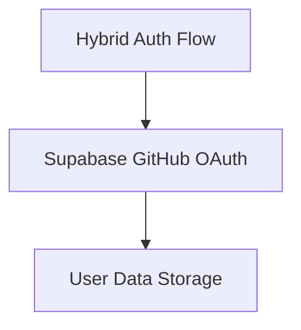

# Chain: Authentication Chain

## Purpose
Implement a comprehensive authentication system with GitHub OAuth integration.

## Patterns
List the patterns used in this chain:

1. **Hybrid Auth Flow**: Central authentication pattern
2. **Supabase GitHub OAuth**: External authentication integration

## Pattern Relationships


## Implementation Sequence
1. First, implement Hybrid Auth Flow pattern
   ```typescript
   // Core auth flow setup
   const authFlow = new HybridAuthFlow({
     defaultProvider: 'github',
     fallbackOptions: ['username', 'magic-link']
   });
   ```

2. Next, implement Supabase GitHub OAuth
   ```typescript
   // GitHub OAuth integration
   const githubAuth = new SupabaseGitHubOAuth({
     clientId: process.env.GITHUB_CLIENT_ID,
     clientSecret: process.env.GITHUB_CLIENT_SECRET,
     redirectUrl: `${process.env.BASE_URL}/api/auth/callback/github`
   });
   
   authFlow.registerProvider('github', githubAuth);
   ```

## Verification Criteria
- User can sign in with GitHub credentials
- Authentication state persists across sessions
- Fallback authentication methods work when GitHub is unavailable

## Customization Options
- Add additional OAuth providers (Google, Twitter, etc.)
- Customize the authentication UI
- Implement role-based authorization

## Chain Evolution
- **v1.0**: Initial version with GitHub OAuth (current) 